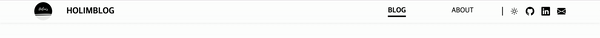
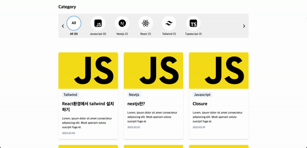
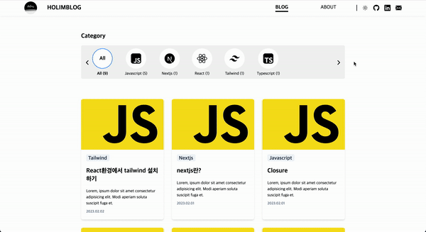
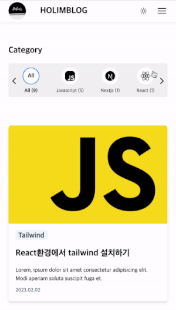
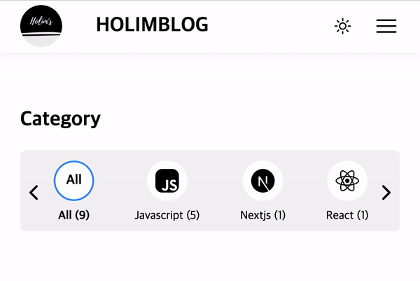
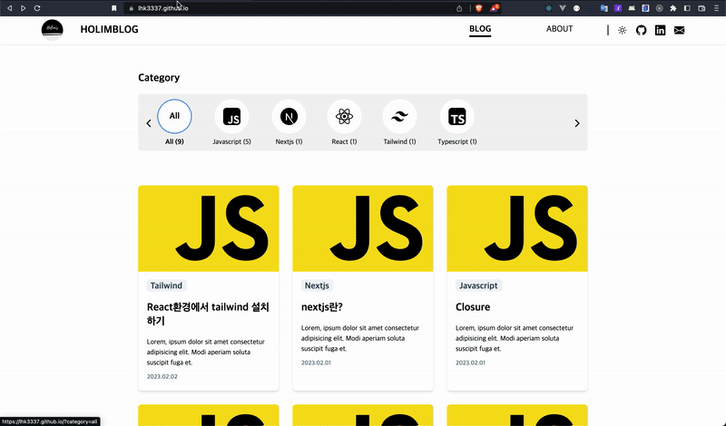
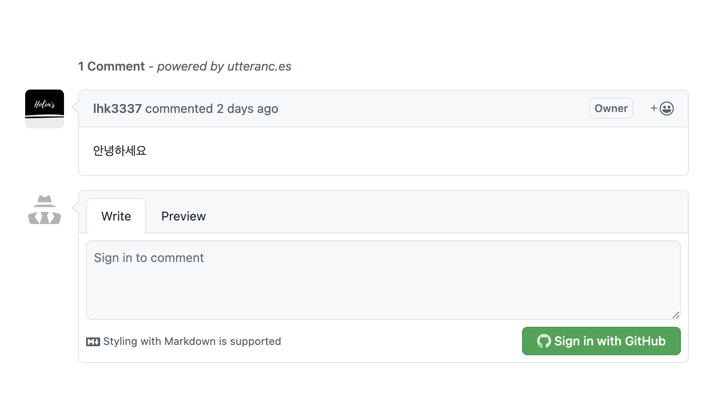
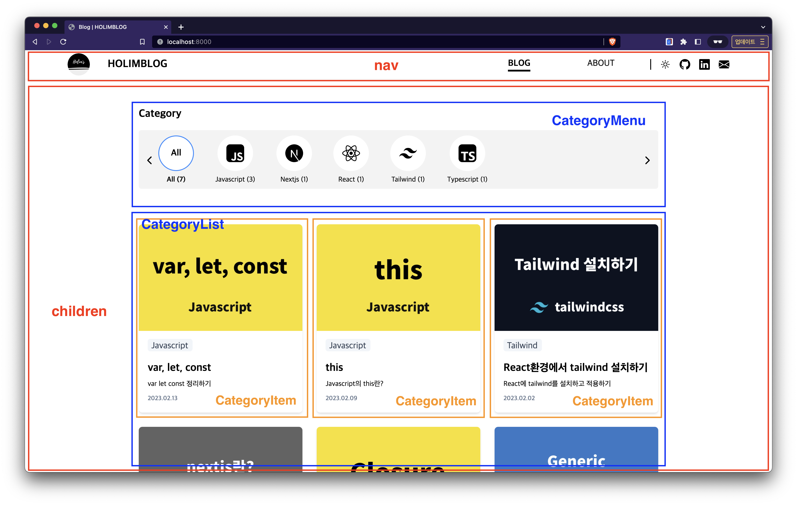

<br />
<h1 align="center">
<image src="./docs/icon.png" width="50" /> <br />
Gatsby로 BLOG 만들기
</h1>

## Gatsby를 선택한 이유

- 예전에 jeklly를 이용하여 blog를 만들었는데 jeklly에 사용하는 Ruby 사용이 익숙하지 않고, 검색을 해도 많은 자료가 없어서 완성 후 블로그 기능을 업데이트 하기가 어려웠습니다.
- Gatsby는 React 환경을 제공하기 떄문에, 익숙한 개발 환경에서 블로그를 만들 수 있다고 생각하였습니다.

## Use Stack

| Kinds               | Description                                                                                                                                                                                                        |
| ------------------- | ------------------------------------------------------------------------------------------------------------------------------------------------------------------------------------------------------------------ |
| Framework & Library |   |
| Language            |                                                                                                    |
| CSS framework       |                                                                                                 |
| Deploy              |                                                                                                              |

## 코드 실행 하기

```shell
npm install
npm start
```

localhost:8000 접속

## 목차

- [design](#design)
- [기능](#기능)
- [구현](#구현)

## Design

- ### [figma Design](https://www.figma.com/file/ngSymMJadxkT4UCs4lWVAl/tech-blog?node-id=1%3A2&t=5fpGpKMTXQFCVQTt-1)

## 기능

### 1. 반응형

화면 사이즈를 줄이면 블로그도 같이 크기가 변경된다.

|      nav menu       |         content         |
| :-----------------: | :---------------------: |
|  |  |

### 2. 다크모드

블로그 다크모드 버튼을 클릭하게 되면 모드가 변경

|                        Full Screen                        |       mobile Screen        |
| :-------------------------------------------------------: | :------------------------: |
|  |  |

### 3. category menu horizon slider scroll

많은 카테고리 메뉴를 나열하기 위해 horizon scroll 구현

|                                      |
| ------------------------------------ |
|  |

### 4. Blog detail Page & comments

- category list의 항목을 클릭하면 blog페이지로 이동
- Blog Post 아래에 comments추가, utteranc.es을 이용하여 추가

|               Blog Detail Page               |                   Comments                    |
| :------------------------------------------: | :-------------------------------------------: |
|  |  |

## 구현

### 목차

- [레이아웃](#레이아웃)
- [폴더별 구조](#폴더별-구조)
- [routing 설정 하기](#routing-설정-하기)
- [markdown 설정 하기](#markdown-설정-하기)
- [nav 메뉴 url에 따라 border 표시하기](#nav-메뉴-url에-따라-border-표시하기)
- [다크모드 라이트 모드](#다크모드-라이트-모드)
- [카테고리 메뉴 설정 및 필터링](#카테고리-메뉴-설정-및-필터링)
- [자동 배포 설정](#자동-배포-설정)

### 레이아웃



### 폴더별 구조

```bash
├── blog-post
├── public
├── node_modules
├── gatsby-browser.ts
├── gatsby-config.ts
├── gatsby-node.ts
├── gatsby-ssr.ts
├── package.json
├── postcss.config.js
├── src
│   ├── components
│   ├── gatsby-types.d.ts
│   ├── hooks
│   ├── index.d.ts
│   ├── libs
│   ├── pages
│   └── styles
├── static
│   └── assets
├── tailwind.config.js
└── tsconfig.json
```

| 폴더                    | 역할                                                                        |
| ----------------------- | --------------------------------------------------------------------------- |
| `blog-post`             | 블로그 포스팅에 관련된 content md형식                                       |
| `public`                | 빌드된 파일을 배포하기 위해 저장                                            |
| `gatsby-browser.ts`     | Gatsby 브라우저 API 사용 설정 파일                                          |
| `gatsby-config.ts`      | Gatsby 설정파일, 블로그 정보 설정 및 추가 된 플러그인을 설정 하기 위한 파일 |
| `gatsby-node.ts`        | Gatsby node api 설정파일                                                    |
| `gatsby-ssr.ts`         | Gatsby server side rendering api 설정 파일                                  |
| `src`                   | 대부분의 gatsby 코드가 여기에 속한다                                        |
| `src/components`        | layout 및 공용으로 사용 할 수 있는 component를 설정                         |
| `src/hooks`             | 블로그 내에서 사용할 수 있는 hooks를 저장                                   |
| `src/libs`              | 공통으로 사용 할 수 있는 함수를 저장                                        |
| `src/pages`             | pages 하위의 디렉토리 이름에 따라 라우팅이 결정                             |
| `src/styles`            | tailwind 환경에서 css을 사용 할수 있도록 설정한 root css 파일               |
| `src/gatsby-types.d.ts` | Gatsby graphql query의 타입이 저장                                          |
| `src/index.d`           | typescript 예외적인 타입을 custom 설정                                      |
| `static`                | 블로그에 사용할 로컬 이미지 파일을 저장                                     |
| `tailwind.config.js`    | tailwind css를 설정할 수 있는 파일                                          |
| `tsconfig.json`         | typescript를 설정할 수 있는 파일                                            |

<br />

### routing 설정 하기

| Path                              | desc                             |
| --------------------------------- | -------------------------------- |
| `/`                               | 메인 홈페이지                    |
| `/?category=해당 카테고리`        | 메인 메뉴 필터링 페이지 보여주기 |
| `/blog/해당 포스트 markdown slug` | 해당 블로그 포스트 페이지        |
| `/about`                          | 소개글 페이지                    |

<br />

### markdown 설정 하기

markdown 정보들을 상위에 설정, 이 정보들은 gatsby graphQL query로 다른 페이지에서 불러와 데이터로 사용할 수 있다.

```
---
slug: "/nextjs/desc"
date: "2023-02-01"
title: "nextjs란?"
categories: ["Nextjs"]
desc: "nextjs에 대해서 알아봅시다"
thumbnail: "./thumbnail.png"
---
```

- `slug` : 블로그 주소를 지정
- `data` : 언제 포스트 했는지 날짜 지정
- `title` : 블로그 포스트 제목
- `category` : 이 포스트의 카테고리 설정
- `desc` : 포스트의 간단한 설명
- `thumbnail` : 포스트의 썸네일

<br />

### nav 메뉴 url에 따라 border 표시하기

```tsx
// pages/index.tsx
export default function IndexPage({ location }) { // gatsby에 location을 props에 선언하면 routing의 대한 정보가 출력된다.

......

return (
    <Layout location={location.pathname}>
    ....
    <Layout>
)
```

```tsx
// component/layout.tsx
export default function Layout({ children, location }: LayoutProps) {
  return (
    <main>
      <Nav location={location} />
      {children}
    </main>
  );
}
```

```tsx
// component/nav/index.tsx
...
<MenuBtn location={location} />
...

// component/nav/menu-btn.tsx
<li
  className={cls(
    location === "/" || location?.substring(0, 6) === "/blog/" // 경로 조건에 해당 하면 border를 표시하도록 설정
      ? "border-b-4 border-b-black font-bold dark:border-b-white"
      : "",
    isMenu ? "rounded-lg border-none py-3 px-5 hover:bg-gray-100 hover:dark:bg-slate-700" : ""
  )}
>
  .....
</li>
```

### 다크모드 라이트 모드

tailwind css를 적용하여 다크모드를 구현하였다.

```js
// tailwind.config.js
/** @type {import('tailwindcss').Config} */
module.exports = {
    ....
    darkMode: "class",
}

```

버튼을 누르면 바뀌고 새로고침해도 유지 하도록 localStorag를 사용

```tsx
// component/nav/index.tsx
const isDarkClick = () => {
  return themeToggler();
};

<button onClick={isDarkClick} />;
```

```ts
// src/hooks/useTheme.ts
import { useState, useCallback, useEffect } from "react";

const useTheme = () => {
  const [theme, setTheme] = useState("");

  const themeToggler = useCallback(() => {
    const nextTheme = theme === "light" ? "dark" : "light";
    setTheme(nextTheme);
    window.__setPreferredTheme(nextTheme);
  }, [theme]);

  useEffect(() => {
    if (typeof window !== "undefined") {
      setTheme(window.__theme);
    }

    window.__onThemeChange = (newTheme: string) => {
      setTheme(newTheme);
    };
  }, []);

  return [theme, themeToggler] as const;
};

export default useTheme;

// window 설정한 부분은 gatsby-ssr.ts에 있음
```

```ts
const React = require("react");

exports.onRenderBody = ({ setPreBodyComponents }) => {
  setPreBodyComponents([
    React.createElement("script", {
      dangerouslySetInnerHTML: {
        __html: `
          (() => {    
            window.__onThemeChange = function() {};      

            function setTheme(newTheme) {                  
              window.__theme = newTheme;                  
              preferredTheme = newTheme;                  
              document.body.className = newTheme;
              document.body.dataset.theme = newTheme;                 
              window.__onThemeChange(newTheme);                
            }

            let preferredTheme

            try {
              preferredTheme = localStorage.getItem('theme')
            } catch (err) {}

            window.__setPreferredTheme = newTheme => {
              setTheme(newTheme)

              try {
                localStorage.setItem('theme', newTheme)
              } catch (err) {}
            }

            let darkQuery = window.matchMedia('(prefers-color-scheme: dark)')

            darkQuery.addEventListener('change', e => {
              window.__setPreferredTheme(e.matches ? 'dark' : 'light')
            })

            setTheme(preferredTheme || (darkQuery.matches ? 'dark' : 'light'))
          })()
        `,
      },
    }),
  ]);
};
/* 
  현재 pc에 설정된 다크 모드 및 라이트 모드의 현재값을 localStorage 초기값으로 저장
  toggle 클릭 상태에 따라 body className에 dark 및 light로 변경, localStorage도 dark, light로 저장
  설정된 값은 useTheme의 useEffect에서 실행 된다.
*/
```

### 카테고리 메뉴 설정 및 필터링

메뉴 카테고리 버튼을 클릭하면 url 쿼리에 따라 필터링 설정

```tsx
// src/pages/index.tsx
export default function IndexPage({ location, data }) {
  const { search } = location; // url 쿼리를 출력한다.
  // "?category=javascript"
  const [_, query] = search.split("=");
  // 문자열을 = 기준으로 뒤에 있는 카테고리 이름을 query변수로 만듦
  const selectedCategory = query === undefined ? "all" : query; // 처음으로 접속하면 all로 default 처리

  return (
    <CategoryMenu data={data} location={location} />
    <CategoryList data={data} selectedCategory={selectedCategory} />
  )
}
```

카테고리 메뉴 설정 하기 해당 포스트 마크다운에서 카테고리 설정한 것만 메뉴에 나타내기

```tsx
// src/components/categories/categoryMenu
const { search } = location;
const [_, query] = search.split("="); // url 쿼리가 같으면 버튼이 강조되게 설정

const scrollRef = useRef<HTMLUListElement>(null);
const [scrollX, setScrollX] = useState(0);
  const slide = (shift: number) => {
    if (scrollRef.current) {
      scrollRef.current.scrollLeft += shift;
    }
    setScrollX(scrollX + shift);
  };
  // horizon scroll 설정

// data는 index.tsx에서 가져온 graph ql query data
const categoriesData = {
  ...data.allMarkdownRemark,
  group: data.allMarkdownRemark.group.map((categoryItem) => {
    return {
      ...categoryItem,
      Javascript: <JsIcons />,  // 해당 component는 svg 태그,
      React: <ReactIcon />,
      Typescript: <TsIcon />,
      Nextjs: <NextJsIcon />,
      Tailwind: <TailwinIcon />,
    };
  }),
};
// 기존 data에 icon 항목을 추가하여 새로운 객체를 생성

return (
...
<ul  ref={scrollRef}>  horizon scroll 적용
...
  {categoriesData.group.map((caterory: Values, i) => {
          return (
            <li key={i}>
              <Link to={`?category=${caterory.fieldValue.toLowerCase()}`}>
                <div className={cls(
                    query === caterory.fieldValue.toLowerCase() ? "border-2 border-[#2E8EFF]" : ""
                  )}>
                  {caterory[caterory.fieldValue]}
                </div>
                <span className={cls(query === caterory.fieldValue.toLowerCase() ? "font-bold" : "")}>
                  {caterory.fieldValue} ({caterory.totalCount})
                </span>
              </Link>
            </li>
          );
        })}
...
</ul>

)
```

index에서 url쿼리가 저장된 selectedCategory에 따라 필터링 됨

```tsx
// scr/components/categories/categoryList.tsx

<div className="category_lists">
  {selectedCategory === "all"
    ? // category가 all일때 모든 post가 출력
      data.allMarkdownRemark.edges.map((value, i) => {
        return <CategoryItem {...value.node.frontmatter} key={i} />;
      })
    : // category가 해당 category일때 해당 post 출력
      data.allMarkdownRemark.edges
        .filter((value) => value.node.frontmatter.categories[0].toLowerCase() === selectedCategory)
        .map((item, i) => {
          return <CategoryItem {...item.node.frontmatter} key={i} />;
        })}
</div>
```

### 자동 배포 설정

## 이슈

## 블로그 만들면서 배운 점

- layout을 만들면서 React children의 개념을 명확히 이해하게 되었습니다.
- gatsby의 SSR이 어떻게 구동 되는지 이해 할 수 있었습니다.
- tailwind를 이용하여 dark 모드를 구현하는 방법을 알게 되었습니다.
- 구글과 네이버에 블로그를 서치를 등록하면서 SEO를 알게 되었습니다.
