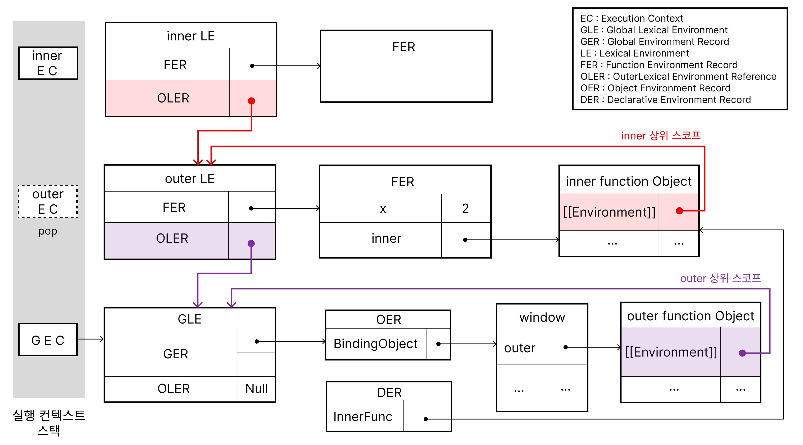

> javascript 클로저는 어떤 함수에서 선언한 변수를 참조하는 내부함수를 외부로 전달할 경우, 함수의 실행 컨텍스트가 종료된 후에도 해당 변수가 사라지지 않는 현상

## lexical Scope

```js
const x = 1;
function Outer() {
  const x = 10;
  Inner();
}
function Inner() {
  console.log(x); // 1
}
Outer();
```

- Outer 함수안에 Inner함수를 호출하는 부분이 있지만 Inner 함수의 변수 x값은 전역변수의 x값을 출력하였다.
- 함수내부에 **Inner 함수를 호출**하는 부분이 있더라도 상위 스코프를 결정하지 못하고, Outer 함수도 접근하지 못한다.

```js
const x = 1;
function Outer() {
  const x = 10;
  function Inner() {
    console.log(x); // 10
  }
  Inner();
}
Outer();
```

**함수를 선언한 위치**에 따라 상위 하위 스코프가 나눠진다.

- 중첩된 함수아기 때문에 Inner함수에서 Outer함수로 접근이 가능하고 상위 스코프로 Outer함수가 만들어 진다.

## 클로저

다음과 같이 아래 코드를 살펴 보면

```js
function outer(init) {
  const x = 10;
  const inner = function (number) {
    return x + init + number; // 상위 스코프 x와 outer의 매겨 변수인 init를 참조 하고 있다.
  };
  return inner;
}

const innerFunc = outer(1);
console.log(innerFunc(3)); // 10 + 1 + 3 = 14
```

- outer가 실행컨텍스트에 의해 pop이 되면 outer의 x값도 사라져야 하는데, 사라지지 않고 계속 남아 있는 것을 볼 수 있다.
- 그리고 outer가 pop이 되었지만 inner 함수는 pop 되지 않고, 남아 있기 때문에 return된 값이 출력 된것을 볼 수 있다.
- 이때 중첩된 inner함수를 클로저라 부름

### 클로저 조건이 아닌 경우

상위 스코프의 식별자를 참조하지 않을 경우

```js
function outer() {
  const x = 1;
  const y = 2;

  function inner() {
    const z = 3;
    console.log(z);
  }
  return inner;
}
const innerFunc = outer();
innerFunc();
```

상위 스코프의 식별자를 참조 하였지만 중첩 함수인 inner함수가 먼저 종료된 경우

```js
function outer() {
  const x = 1;

  function inner() {
    console.log(x);
  }
  inner();
}
outer();
```

상위 스코프의 식별자를 참조하면서 inner 함수가 먼저 종료 되지 않을때

```js
function outer() {
  const x = 1;

  function inner() {
    console.log(x);
  }
  return inner;
}

const innerFunc = outer();
innerFunc();
```



- outer 함수가 실행 컨텍스트 스택에 의해 pop이 되었지만, 렉시컬 환경까지 없어지지 않는다.
- 그리고 inner function object의 Environment에 참조할 상위 스코프의 렉시컬 환경을 저장한다.
- [[Environment]]가 상위 렉시컬 환경을 참조하고 있기 때문에, outer가 없어졌다 할지라도 x값이 존재한다.

## reference

- javascript deep dive : 클로저
