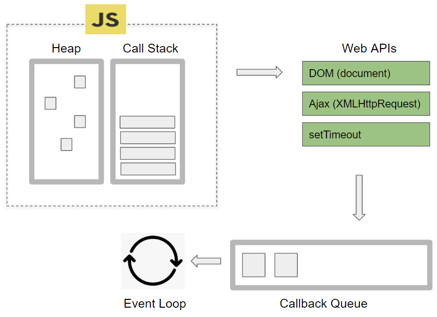
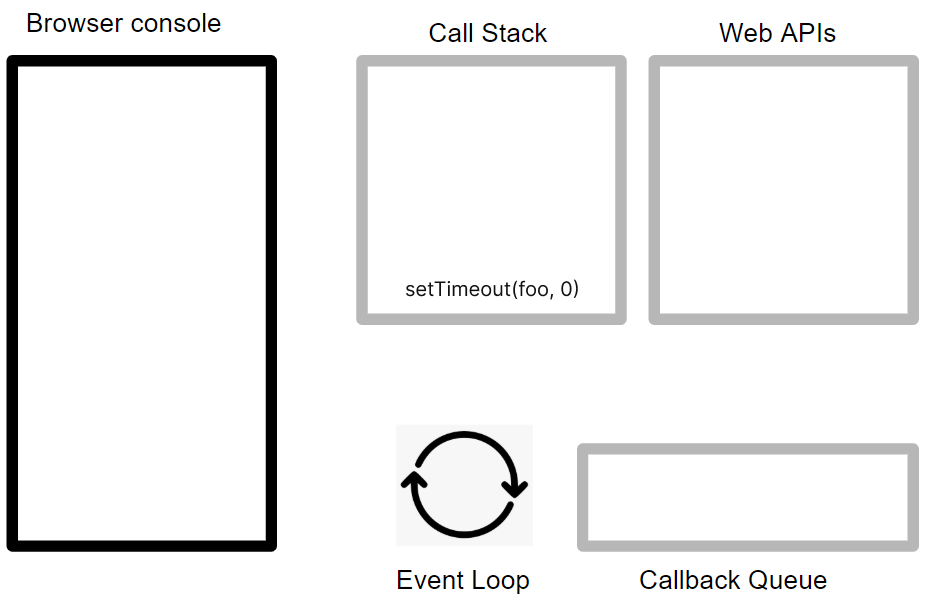
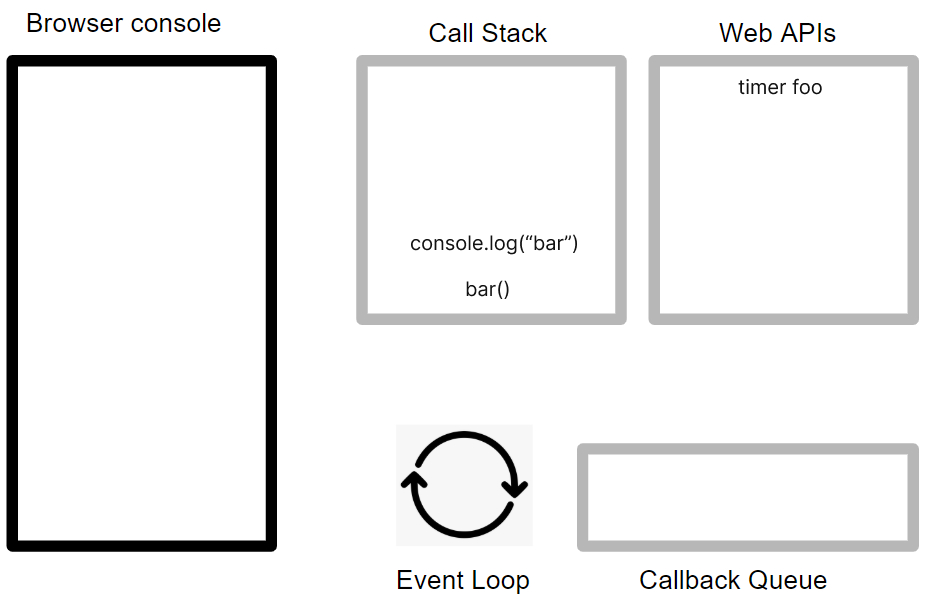
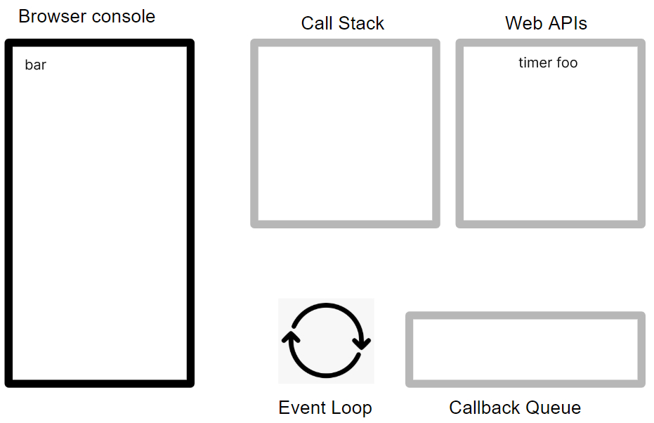
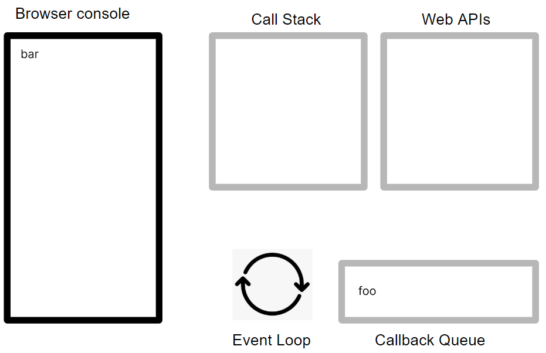
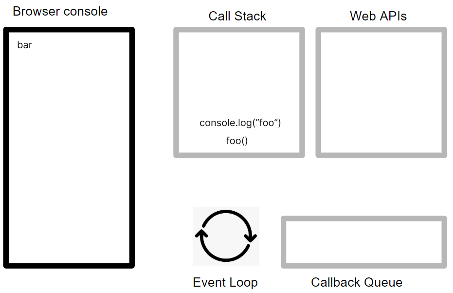
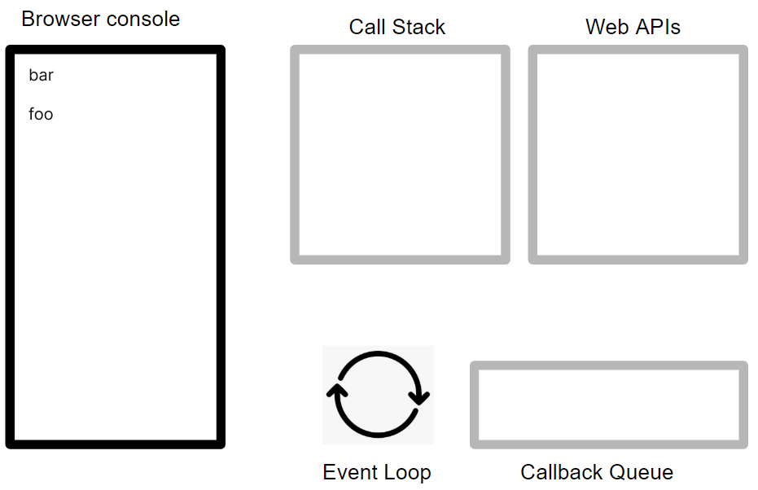

## 이벤트 루프(브라우저에 내장)

자바스크립트는 싱글 스레드 방식으로 동작 하지만, 브라우저에서 동작하는것을 보면 많은 작업들이 동시에 처리 되는 것처럼 느끼는데, 이와 같이 자바스크립트의 동시성을 지원하는 것을 이벤트 루프이다.



**Heap**

메모리할당이 이루어지는 곳, 콜스택의 요소인 실행 컨텍스트는 힙에 저장된 객체를 참조한다.

**Call Stack**

실행 컨텍스트가 순차적으로 콜 스택에 push되어 순차적으로 실행된다. 자바스크립트 엔진은 단 하나의 콜 스택을 사용하기 때문에 최상위 실행 컨텍스트가 종료되어 콜 스택에서 제거되기 전까지는 다른 어떤 태스크도 실행되지 않는다.

**Task queue / event queue / callback queue**

setTimeout이나 setInterval과 같은 비동기 함수의 콜백 함수 또는 이벤트 핸들러가 일시적으로 보관되는 영역

**Evnt loop**

콜 스택에 현재 실행 중인 실행 컨텍스트가 있는지, 그리고 태스크 큐에 대기 중인 함수(콜백 함수, 이벤트 핸들러)가 있는지 반복적으로 확인한다.

## 이벤트 루프 실행 순서

```jsx
function foo() {
  console.log("foo");
}

function bar() {
  console.log("bar");
}

setTimeout(foo, 0);
bar();
```

### 1. setTimeout이 Call Stack에 push됨



### 2. setTime 함수가 실행되면서 time Web API를 호출한다. 그리고 Call Stack에서 pop이 됨


### 3. bar()함수가 Call Stack에 push 된다.


### 4. bar()함수가 실행되고 내부의 console.log(”bar”)가 Call Stack에 push됨.



### 5. console.log(”bar”)가 실행되고, Call Stack에서 pop된다.


### 6. bar()함수도 Call Stack에서 pop된다.



### 7. setTime에서 0ms가 지난 뒤, Callback Queue에 Callback으로 전달한 foo함수가 추가된다.



### 8. Event Loop는 Call Stack에 아무것도 없는 것을 확인하고, 또한 Callback Queue도 확인한다. Callback Queue에 foo를 확인한 Event Loop는 Call Stack에 foo를 추가한다.


### 9. foo()함수가 실행되고 내부의 console.log(”foo”)가 Call Stack에 push됨.



### 10. console.log(”foo”)가 실행되고, Call Stack에서 pop된다.


### 11. 실행할 것이 없기 때문에 foo()함수도 Call Stack에서 pop된다.



## reference

[JavaScript 비동기 핵심 Event Loop 정리](https://medium.com/sjk5766/javascript-%EB%B9%84%EB%8F%99%EA%B8%B0-%ED%95%B5%EC%8B%AC-event-loop-%EC%A0%95%EB%A6%AC-422eb29231a8)
