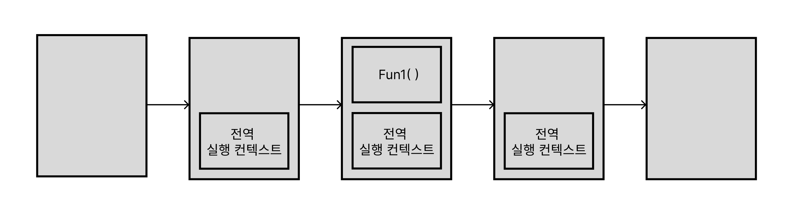
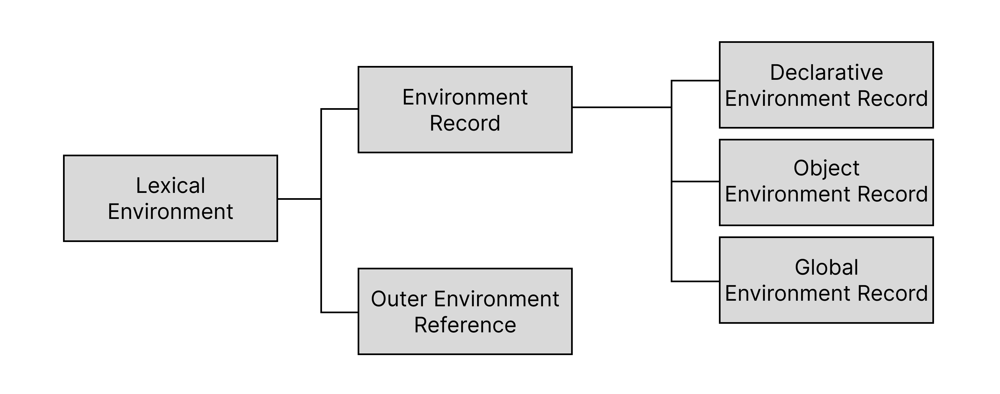
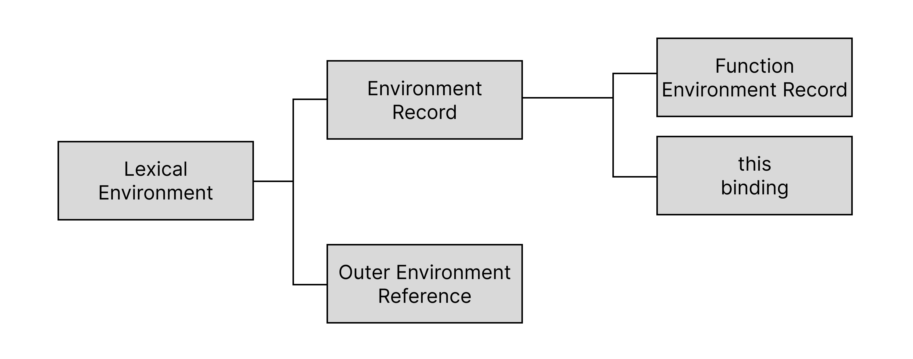
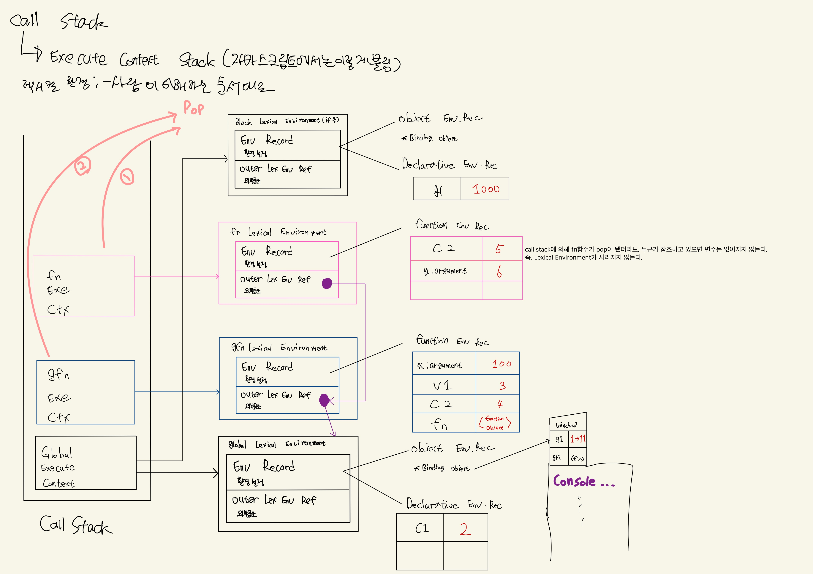

> 실행 컨텍스트(execute context)란? <br />
> 자바스크립트의 코드를 실행 하는데 필요한 환경을 제공하고 실행하고 종료될때까지의 모든 과정을 관리한다. <br />
> (실행컨텍스트도 코드가 실행되면 생성되고 종료되면 없어짐)

## 코드 타입 및 소스코드 컨텍스트

- 자바스크립트는 타입에 따라 실행컨텍스트를 생성하는 과정과 관리 내용이 다르다.
- 그렇기 때문에 여러 타입의 코드(전역코드, 함수코드, eval코드, 모듈 코드)를 구분하고, 이러한 코드들은 실행 컨텍스트를 생성한다.

전역 코드 - 전역으로 선언한 변수 및 함수 선언문

함수 코드 - 지역 변수, 매개변수, arguments,

## 코드의 평가와 실행

이러한 코드들은 평가와 실행이라는 과정으로 처리되고 실행한다.
실행 컨텍스트는 식별자를 스코프에 등록하고(렉시컬 환경으로 관리), 스코프에 따라 코드 순서를 결정한다.

### 전역 코드

- 일단 전역 코드를 평가할때, 선언문을 먼저 실행 후 전역적 실행 컨텍스트를 생성, 그리고 식별자를 실행 컨텍스트에 등록한다.
- 실행 될때 변수는 할당되고, 함수는 호출한다.
- 만일 전역적으로 함수가 선언되고 호출하게 되면 전역 코드의 실행을 중단하고, 함수 내부로 진입

### 함수 코드

- 함수 호출로 인해 실행 순서가 변경 되어 함수가 실행되면 함수내에 실행 컨텍스트가 스택에 push되고 함수내에 있는 코드가 순차적으로 실행
- 함수 코드 실행이 끝나면 스코프체인에 의해 상위 함수를 확인하고, 상위 함수가 있을 경우 상위 함수가 실행하고 종료

```js
const x = 1;
function Fun1() {
  console.lo("Fun1");
}
Fun1();
```



### 렉시컬 환경

렉시컬 환경은 스코프를 구분하여 식별자를 등록하고 관리하는 저장소 역할

타입 종류에는 **Environment Record**와 **Outer Lexical Enviroment Reference** 가 있다.



- Environment Record : 스코프에 포함된 식별자를 등록하고 등록된 식별자에 바인딩된 값을 관리하는 저장소
- Outer Lexical Environment Reference : 외부 렉시컬 환경에 대한 참조는 상위 스코프를 가리킴



### 실행 컨텍스트 과정

```js
var g1 = 1;
const c1 = 2;

function gfn(x) {
  var v1 = 3;
  const c2 = 4;
  g1 = 11;
  function fn(y) {
    const c2 = 5;
    console.log(x + v1 + c2 + g1 + c2 + y);
  }
  fn(6);
}
gfn(100);
if (g1 > 10) {
  let g1 = 100;
}
console.log(g1);
```



## reference

- javascript deep dive : 실행 컨텍스트
