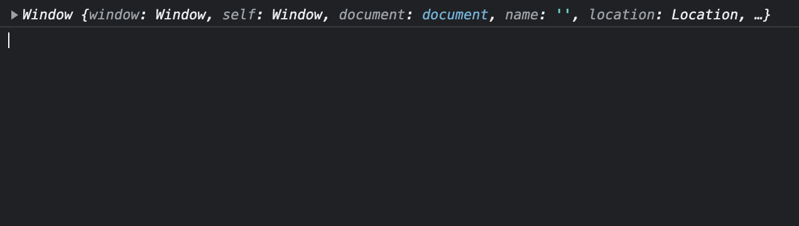
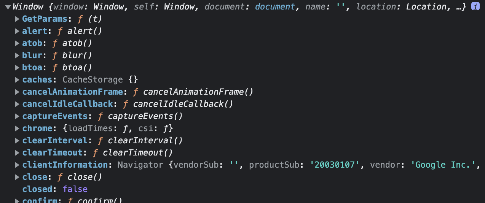
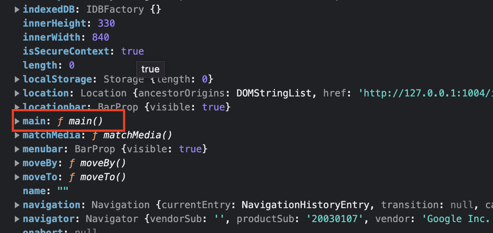

> javascript this는 상황에 따라 가르키는 객체가 달라진다. 그렇기 때문에 this가 있는 코드를 이해하기 쉽지 않다.

> 그래서 javascript this를 정리하면서 이해 해보기로 하였다.

## 전역적인 this

this를 함수 안에서 선언하지 않고 전역 스코프에 선언하게 되면, 브라우저의 window객체가 된다.

```js
console.log(this);
```

```js
if (true) {
  console.log(this);
}
```

```js
"use strict";

console.log(this);
// use strict가 선언 되어있어도 this는 window객체를 반환한다.
```



---

## 함수 내부의 this

함수를 전역 스코프에 선언하게 되면 함수는 window객체에 등록 <br />
그렇기 때문에 this는 함수의 객체인 window를 출력하는 것이다.

```js
function main() {
  console.log(this);
}
main();
```



```js
// main()함수는 window.main()과 같다.
function main() {
  console.log(this);
}
window.main();

// 객체 형태
window = {
  main: main(),
};
```



### 💡예외

```js
"use strict"; // 엄격 모드
function main() {
  console.log(this);
}
main(); // "use strict" 에서 undefined 출력
window.main(); // 직접적으로 호출, window 객체
```

<strong>use strict에서 undefined가 되는 이유</strong>

[mdn-use strict 참조](https://developer.mozilla.org/en-US/docs/Web/JavaScript/Reference/Strict_mode#transitioning_to_strict_mode)

> In sloppy mode, function calls like f() would pass the global object as the this value. In strict mode, it is now undefined. When a function was >called with call or apply, if the value was a primitive value, this one was boxed into an object (or the global object for undefined and null). >In strict mode, the value is passed directly without conversion or replacement.

한마디로 말하면 엄격 모드에서는 값이 직접적으로 전달 되기 때문에 명시적으로 선언해야 한다.

---

## 객체에서의 this

객체의 메서드안에 this를 선언하게 되면 this는 메서드가 포함된 객체를 가르킨다.

```js
const obj = {
  name: "js",
  main: function () {
    console.log(this);
  },
};
obj.main(); // 여기서 this는 obj 객체를 가르킨다. {name: 'js', main: ƒ}
```

```js
const obj = {
  name: "js",
  main: function () {
    console.log(this);
  },
};
const main2 = obj.main;
main2(); // window 객체 출력, main2()는 전역적으로 호출한 함수
```

this는 함수의 위치나 방법에 영향을 받지 않고, 함수가 어디서 호출되는지에서 결정된다. <br />
함수를 미리 선언하고 객체의 메서드로 선언해도 해당 객체의 this값을 반환한다.

```js
function main() {
  console.log(this);
}

const obj = {
  name: "js",
  main: main, // main메서드에 main함수를 선언
};

obj.main(); // obj객체 {name: 'js', main: ƒ}
```

```js
function main() {
  console.log(this);
}

const obj = {
  name: "js",
  innerMain: {
    name: "jsInner",
    main: main,
  },
};

obj.innerMain.main(); // innerMain : {name: 'jsInner', main: ƒ}
```

---

## 화살표 함수에서 this

- 화살표 함수의 this는 선언된 시점에서 this가 결정 되고 바뀌지 않는다.
- 객체의 메서드로 화살표 함수를 사영하게 되면 객체 속성을 접근하지 못하므로 지양해야 한다.

```js
const obj = {
  name: "js",
  main() {
    console.log(this.name);
  },
  mainArrow: () => {
    // 메서드
    console.log(this.name);
  },
};

obj.mainArrow(); // obj객체가 출력되는 것이 아니라 상위에 있는 window 객체가 출력된다.
```

호출할때 일반함수와 화살표 함수 비교

```js
const obj = {
  name: "js",
  main() {
    function innerFunc() {
      // 일반 함수 일때 window
      console.log(this);
    }
    const arrowFunc = () => {
      //화살표 함수 일때 obj 객체
      console.log(this);
    };
    innerFunc();
    arrowFunc();
  },
};

obj.main();
```

- arrowFunc가 선언된 시점이 main이므로 obj의 객체가 된다.
- 일반함수는 객체로 부터 호출을 받지 않아서 window가 출력 된다.

#### 비동기에서 화살표 함수 this

```js
const obj = {
  name: "js",
  main() {
    setTimeout(() => {
      console.log(this); // obj 객체
    }, 1000);
    setTimeout(function () {
      console.log(this);
    }, 1000); // window 객체,
  },
};

obj.main();
```

setTimeout가 있더라도 화살표 함수는 main에서 선언되었기 떄문에 main이 있는 obj 객체가 된다.
setTimeout는 브라우저 api이고 일반 함수는 setTimeout의 영향을 받아서 window객체가 된다.

#### 다시 확인 하기

- 객체가 호출할 함수가 없을 경우 일반 함수의 this는 window 객체가 된다.
- 화살표 함수가 객체의 메서드로 사용될 경우 this는 window 객체가 된다.

---

## Bind()

변경 가능한 this를 명시적으로 선언
함수에 bind를 선언하고 bind안에 인수로 값을 넣게 되면 그 값은 함수안의 this값이 되고, 또한 새로운 함수로 반환해준다.

```js
function main() {
  console.log(this);
}
main(); // window 객체 출력
```

```js
function main() {
  console.log(this);
}
const mainBind = main.bind({ name: "javascript" });
mainBind(); //  {name: 'javascript'}

const obj = {
  mainBind,
};
obj.mainBind(); //  {name: 'javascript'}
```

- mainBind()는 bind 인수로 키:name과 값:'javascript'인 객체가 출력된다. {name: 'javascript'}
- obj객체가 있더라도 mainBind가 bind되어서 this값이 변하지 않음

#### bind안에 bind는 선언할 수 없다.

```js
function main() {
  console.log(this);
}
const mainBind = main.bind({ name: "javascript" });
const mainBindBind = mainBind.bind({ name: "js" }); // mainBindBind의 bind를 무시한다.
mainBindBind(); // {name: 'javascript'}
```

```js
const obj = {
  name: "javascript",
  main: function () {
    console.log(this);
  },
};
obj.main(); // {name: 'javascript'}
```

#### 객체 메서드에 bind()선언 하기

```js
const obj = {
  name: "javascript",
  main: function () {
    console.log(this);
  }.bind({ name: "js" }),
};
obj.main(); // {name: 'js'}
```

---

## event 요소에 this

이벤트에 처리할 함수를 선언하고 함수 내부에 this를 선언하면 그 this는 해당 이벤트 요소 자체를 가르킨다.

```html
<!DOCTYPE html>
<html lang="en">
  <body>
    <button id="btn">확인</button>
  </body>
  <script src="./index.js" defer></script>
</html>
```

```js
// index.js
const button = document.getElementById("btn");

button.addEventListener("click", function () {
  console.log(this); //   <button id="btn">확인</button>
});
```

해당 이벤트 요소와 this가 같은지 비교를 해보면 true가 반환되어 요소와 this가 같다고 볼 수 있다.

```js
button.addEventListener("click", function (event) {
  console.log(this === event.target); //  true
});
```

## refrence

- 별코딩 : javascript-This와 Bind
- mdn : use strict
