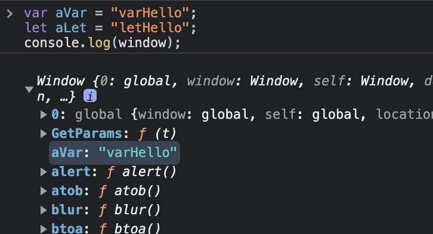

# javascript에서 var let const 비교하기

## Scope

- 스코프란 범위라는 뜻
- 종류에는 Function Scope(var), Block Scope(let), Global Scope가 있다.

---

## Function Scope

변수가 선언된 함수 안에서만 변수를 접근할 수 있다.
<br /> <br />

<b><span style="font-size:150%">var</span></b>

#### 에러 발생

```js
function main() {
  var x = "hi";
}
console.log(x); // RefferenceError, x를 함수내부에 선언하지 않아서 참조 에러가 발생하였다.
// x는 함수 내부에 선언 되어 있고 함수 외부에서 x를 호출하게 되면 Function Scope의해 참조 에러가 발생한다.
```

#### 정상 작동

```js
function main() {
  var x = "hi";
  console.log(x); // 'hi',
}
main();
// 함수 내부에서 x를 호출했기 때문에 오류 없이 출력 되었다.
```

#### 부작용

```js
function main() {
  var x = "hello";
  if (true) {
    var x = "hi";
  }
  console.log(x); // 'hi',
}
main();
// var 변수는 if블록이 있더라도 함수 스코프이기 때문에 함수 내부에서 어디서든지 변수를 참조 할 수 있다.
// x = "hello"가 출력 될꺼 같지만, 함수 스코프로 인해 var x는 같은 스코프 이고, var는 재할당 할 수 있어서 hello가 hi로 변경 되었다.
```

```js
// 이것을 풀어보면 이런 형태가 된다.
function main() {
  var x = "hello";
  var x = "hi";

  console.log(x); // 'hi',
}
main();
```

---

## Block Scope

<b><span style="font-size:150%">let</span></b>

재할당을 방지 하려면 var 대신 let를 사용하면 중복되지 않고 참조 에러를 발생 시킨다.

- let은 block scope이므로 중괄호를 기준으로 스코프를 가진다.
- block 외부에는 접근을 금지 하여 부작용을 방지 할 수 있다.

```js
function main() {
  if (true) {
    let x = "hi";
  }
  console.log(x); // RefferenceError
}
main();

function main() {
  if (true) {
    let x = "hi";
    console.log(x); // hi 출력
  }
}
main();
```

```js
function main() {
  let x = "hello";
  if (true) {
    let x = "hi";
  }
  console.log(x); // hello 출력
}
main();
// if문안에 있는 변수 x는 if문 안에서만 사용 할 수 있는 변수이고, console.log(x)의 x는 같은 스코프에 있는 let x = "hello"이다.
```

### Global Scope

- 전역 변수로 var를 선언하게 되면 var 변수는 window객체에 속성으로 등록된다.
- window객체는 브라우저에서 단 하나밖에 없는 객체이고, 모든 코드 및 라이브러리를 공유하고 있어서 window에 속성으로 등록 하면 부작용이 일어날 수 있다.

```js
var aVar = "varHello";
let aLet = "letHello";
console.log(window);
```



하지만 let 변수를 선언하면 window객체에 등록 되지 않고, 안전하게 사용 할 수 있다.

### 중복 선언

```js
var x = "good";
var x = "bye";
console.log(x); // bye, 재할당 됨
```

```js
let x = "good";
let x = "bye";
console.log(x); //Uncaught SyntaxError: Identifier 'x' has already been declared, 중복 선언 에러
```

<br />

---

## hoisting

변수 선언문이 코드의 선두로 끌어 올려진 것처럼 동작하는 방식을 hoisting이라고 한다.

> 선언 단계란 변수 이름을 등록해서 자바스크립트 엔진에 변수의 존재를 알린다.

> 초기화 단계란 값을 저장하기 위한 메모리 공간을 확보하고 암묵적으로 undefined를 할당해 초기화 한다.

> 할당 단계란 값을 변수의 메모리 공간에 저장

<b><span style="font-size:150%">var</span></b>

```js
console.log(num); //undefined 선언과 초기화가 같이 이루어짐
var num = 10;
console.log(num); // 10
```

#### 위의 코드의 순서를 보면

```js
var num; //선언과 초기화가 일어남
console.log(num); // 선언과 초기화가 같이 일어나 undefined로 초기화 됨
num = 10; // 값 10이 할당
```

- 변수 var는 선언과 초기화가 같이 이루지기 때문에 암묵적으로 undefined를 할당한다.

<b><span style="font-size:150%">let</span></b>

- let도 hoisting되어 선언문이 코드의 선두로 올려지긴 하지만 <strong>TDZ(Temporal Dead Zone)</strong>때문에 참조에러를 발생 시킨다.
- TDZ는 초기화 단계 이전에 변수에 접근하면 참조 에러를 발생 시킨다.
- let은 선언 단계와 초기화 단계가 분리되어 선언 단계에서 hoisting이 일어나지만, var 변수처럼 선언과 초기화 단계가 같이 일어나지 않는다.
- 변수 선언문을 만나게 되면 초기화 단계가 실행 된다.

```js
console.log(num); // 일시적 사각지대안에 있음, 참조에러 발생
let num = 10;
console.log(num);
```

## const

- 상수 선언, 할당하면 재할당 할 수 없음, block Scope

```js
const a = "hi";
a = "hello"; // 재할당 금지
```

```js
const a; // 선언만 할 경우 에러 발생
```

```js
const a = 1; //선언과 초기화를 동시에 선언해야 한다.
```

var, let은 선언문에서 초기화 단계가 실행되지만, (var a, let a), const는 재할당을 할 수 없기 때문에 선언만 해도 초기화 하라는 에러가 발생한다.

<br />

<strong>하지만 const가 상수라도 객체의 속성을 바꿀 수 있다.</strong>

```js
const a = {
  x: 1,
  y: 2,
};
a.x = 3;
console.log(a); //{x:1, y:2}에서 {x:3, y:2}로 변경 되었다.
```

새로운 객체를 할당하는것이 아니라 이미 가지고 있는 객체를 유지하면서 내부적인 속성을 변경해서 가능하다.

<br />

<strong>Object.freeze</strong>를 사용해 객체의 속성 변경을 막을 수 있다.

```js
const a = Object.freeze({
  x: 1,
  y: 2,
});
a.x = 3;
console.log(a); // {x:1, y:2}로 고정된다.
```

## referance

- 별코딩 var, let, const
- 모던 자바스크립트 Deep Dive : 변수
