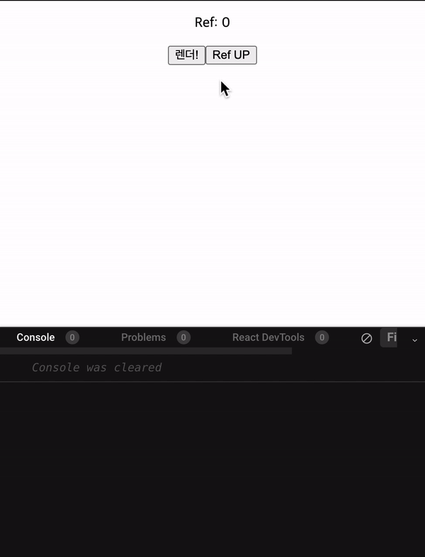
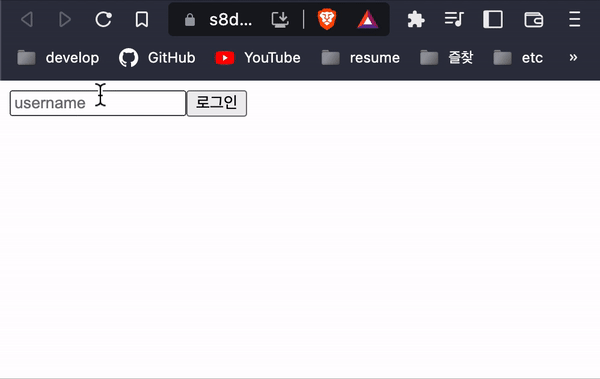

# React에서 다양한 hooks들

prevState

```jsx
const [state, setState] = useState({
  loading: false,
});

setState({ ...state, loading: true });
setState((prevState) => ({ ...prevState, loading: true }));
```

[[Legacy][React] state, setState, useState 란 무엇일까?](https://codiving.kr/21)

# useRef

변화는 감지 하지만, 그 변화가 랜더링이 발생시키면 안되는 어떤 값을 다룰때 사용한다. (리랜더링이 일어나지 않는다.)

```tsx
import { useRef, useState } from "react";

const countRef = useRef(0);
const [renderer, setRenderer] = useState(0);

const increaseRef = () => {
  countRef.current = countRef.current + 1;
  console.log("Ref :", countRef.current);
};

const doRendering = () => {
  setRenderer(renderer + 1);
};

return (
  <div>
    <p>Ref: {countRef.current}</p>
    <button onClick={doRendering}>렌더!</button>
    <button onClick={increaseRef}>Ref UP</button>
  </div>
);
```

<br />

<p align="center">
  
</p>
<figcaption>Result</figcaption>

<br />

DOM 요소에 접근

```tsx
import { useEffect, useRef } from "react";

export default function App() {
  const inputRef = useRef();

  useEffect(() => {
    // console.log(inputRef);
    inputRef.current.focus();
  }, []);
  const login = () => {
    alert(`welcome ${inputRef.current.value}!`);
    inputRef.current.focus();
  };
  return (
    <div className="App">
      <input ref={inputRef} type="text" placeholder="username" />
      <button onClick={login}>로그인</button>
    </div>
  );
}
```

<br />

<p align="center">
  
</p>

<figcaption><b>Dom 요소 접근</b></figcaption>
