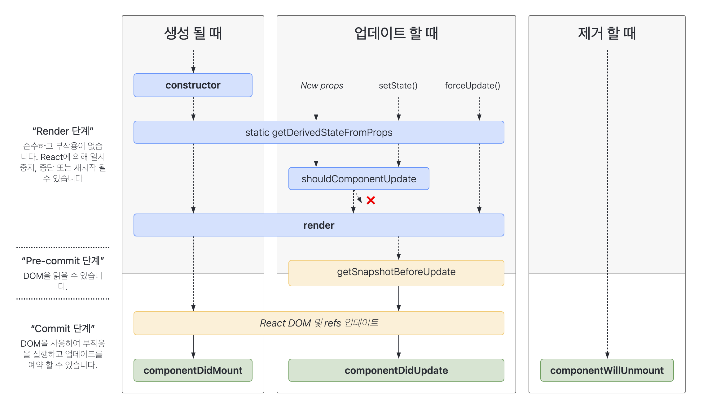

리액트에서 component가 생성되고 사라지는 생명주기(life cycle)란?



## class Life Cycle

- 클래스의 경우 -> constructor -> render -> ref -> componentDidMount
- (setState/props 바뀔때 -> shouldComponentUpdate(true) -> reRender -> componentDidUpdate)
- parents component에서 children component가 사라질 경우 -> componentWillUnmount -> 소멸

### 1. componentDidMount(){}

- 처음에 렌더함수가 성공적으로 수행했다면 componentDidMount가 실행됨, -> 비동기 요청을 많이 함
- 리렌더링이 일어날때 실행되지 않음
- 그렇기에 함수 안쪽에 위치해야 한다.

### 2. componentDidUpdate() {}

- 리랜더링 후 실행

### 3. componentWillUnmount() {}

- 컴포넌트가 제거 되기 직전, 부모 컴포넌트가 자식 컴포넌트를 삭제할때 실행 됨, 비동기 요청 정리를 많이 함

## Hooks Life Cycle

useEffect를 이용하여 class life style과 같은 효과를 낼 수 있다.

```js
useEffect(() => {
  // 모든 값의 변화에 인지함
  console.log("component did mount");
});
```

```js
useEffect(() => {
  // 최초에 한번 인지
  console.log("component did mount");
}, []); //ComponentDidMount
```

```js
useEffect(() => {
  // name 값의 변화에만 인지함
  console.log("component did update");
}, [name]); //componentDidUpdate
```

```js
useEffect(() => {
  return () => {
    console.log("component Will Unmount"); //componentWillUnmount
  };
});
```

---

## 참조

- [React LifeCycle](https://ko.reactjs.org/docs/state-and-lifecycle.html)
- [React useEffect](https://ko.reactjs.org/docs/hooks-effect.html)
- [ZeroCho 리액트 강의](https://www.youtube.com/watch?v=F8eqh1Y4n3k&list=PLcqDmjxt30RtqbStQqk-eYMK8N-1SYIFn&index=41)
- [React LifeCycle 사진 출처](https://projects.wojtekmaj.pl/react-lifecycle-methods-diagram/)
