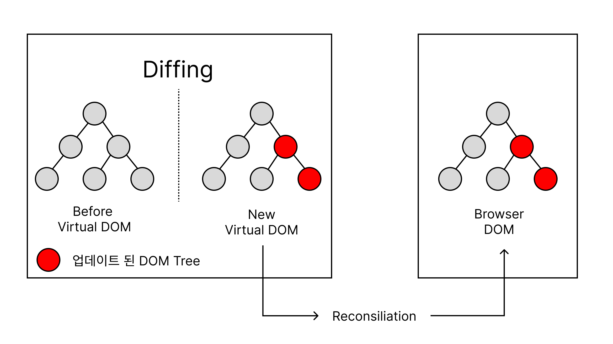

### 정의

리액트(react)에서 Virtual DOM은 브라우저의 DOM(Document Object Model)을 추상화한 가상의 DOM입니다.

### 특징

- 불필요한 DOM 조작을 최소화하고, 성능을 향상시킬 수 있습니다.
  Virtual DOM은 일반적으로 Javascript 객체로 표현되며, 리액트 엘리먼트(React element)라고도 불립니다.
  이 객체는 렌더링된 HTML 요소를 표현하는데 필요한 모든 정보를 포함합니다.

Virtual DOM은 실제 DOM과는 달리 메모리 상에 존재하므로, 빠른 속도로 조작할 수 있습니다. 따라서 React는 렌더링의 성능을 향상시키면서도, 실제 DOM과 일치하는 사용자 인터페이스를 유지하고 유지보수성, 재사용성을 제공합니다. 또한, Virtual DOM을 이용하여 React는 다양한 플랫폼에서 동작하는 애플리케이션을 개발할 수 있습니다.

### React의 Virtual DOM 구조 및 동작 방식

React에서는 두가지 Vitual DOM을 가지고 있습니다.

- 첫번 째 Virtual DOM은 변경 이전의 내용을 담고 있습니다.
- 만일 컴포넌트의 상태(state)나 속성(props)이 변경되면 두번째 Virtual DOM에 변경 이후에 보여질 내용을 담겨집니다.
- 변경이 일어 났는지 리액트는 두 개의 Virtual DOM을 비교해서 정확히 어떤 부분이 변경 되었는지 효율적으로 비교하여 파악한다. 이 과정은 Diffing이라고 한다.
- Diffing을 통해서 변경된 부분들을 파악한 이후에, 리액트는 Batch Update를 수행함으로 실제 DOM에 한번에 적용시켜주는 과정을 Reconsiliation, 재조정 이라고 한다.

## refrence

- [[React] DOM이란? Virtual DOM을 사용하는 이유?](https://velog.io/@ctdlog/React-DOM이란-Virtual-DOM을-사용하는-이유)
