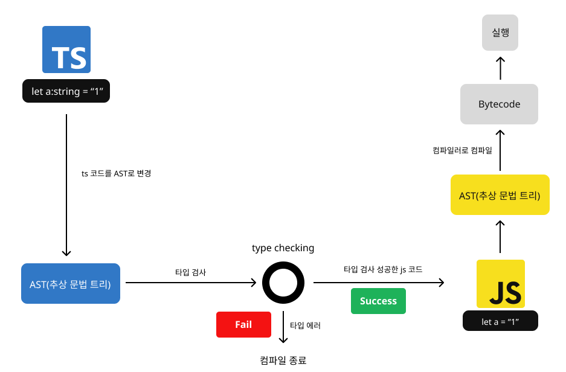
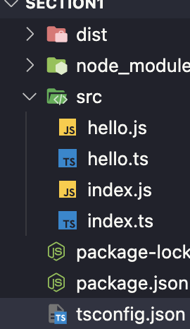

## TypeScript

### 소개

- 자바스크립트는 타입을 엄격하게 확인 하지 않기 때문에 안정성이 떨어져 타입이 변경되는 버그가 발생한다.
- 이러한 문제점을 해결하기 위해서 기존 문법은 그대로 남겨두고, 타입에 대한 엄격한 확인을 하면서 안전하게 자바스크립트를 사용할 수 있도록 개발 되었다.

### 동작 원리

- 타입스크립트가 컴파일 될때 타입스크립트는 AST(추상 문법 트리)로 변환한다.
- 변환된 AST는 타입검사(type checking)을 시작한다.
- 타입 검사가 성공적으로 이루어지면, AST를 자바스크립트 코드로 변환하게 되고 컴파일이 종료된다.
- 만일 타입 검사가 실패할 경우, 코드 변경없이 컴파일이 종료된다.



### 컴파일러 옵션 설정하기

- 타입스크립트 코드를 자바스크립트 코드로 변환 할때, 이러한 과정에서 세부적인 것들을 설정하기 위해 컴파일러 옵션을 사용한다.

```bash
$ tsc --init
```

위의 명령어를 입력하면 최상위 디렉토리에 `tsconfig.json`이 생성된다. 여기에는 모든 옵션이 주석으로 포함되어 있다.

### - include 옵션

컴파일할 타입스크립트 파일들을 한번에 컴파일하기 위한 폴더를 설정한다.

```json {numberLines}
{
  "include": ["src"]
}
```

`src` 폴더안의 타입스크립트 파일들이 한번에 컴파일된다.

```ts {numberLines}
let a: string = "1";
```

```bash
$ tsc
```



### - target 옵션

타입스크립트를 자바스크립트로 변환할때 자바스크립트의 버전을 설정한다.

```json {numberLines}
{
  "compilerOptions": {
    "target": "ES5"
  },
  "include": ["src"]
}
```

타입스크립트를 자바스크립트 ES5버전으로 변환되었다.

```ts {numberLines}
// index.ts
const func = () => console.log("Hello TS");
```

```js {numberLines}
// index.js
var func = function () {
  return console.log("Hello TS");
};
```

### - module 옵션

자바스크립트의 모듈을 설정한다.

CommonJS

```json {numberLines}
{
  "compilerOptions": {
    "target": "ESNext",
    "module": "CommonJS"
  },
  "include": ["src"]
}
```

```ts {numberLines}
// index.ts
import { hello } from "./hello";
console.log(hello);

// hello.ts
export const hello = () => {
  console.log("hello");
};
```

컴파일 결과

```js {numberLines}
// index.js
"use strict";
Object.defineProperty(exports, "__esModule", { value: true });
var hello_1 = require("./hello");
console.log(hello_1.hello);

// hello.js
("use strict");
Object.defineProperty(exports, "__esModule", { value: true });
exports.hello = void 0;
var hello = function () {
  console.log("hello");
};
exports.hello = hello;
```

ESNext

ESNext는 ESM형식으로 변환된다.

```json {numberLines}
{
  "compilerOptions": {
    "target": "ESNext",
    "module": "ESNext"
  },
  "include": ["src"]
}
```

```ts {numberLines}
// index.ts
import { hello } from "./hello";
console.log(hello);

// hello.ts
export const hello = () => {
  console.log("hello");
};
```

컴파일 결과

```js {numberLines}
// index.js
import { hello } from "./hello";
console.log(hello);

// hello.js
export var hello = function () {
  console.log("hello");
};
```

### - outDir 옵션

컴파일된 자바스크립트 파일의 위치를 설정한다.

```json {numberLines}
{
  "compilerOptions": {
    "target": "ESNext",
    "module": "ESNext",
    "outDir": "dist" // 컴파일된 js파일이 dist 폴더에 생성된다.
  },
  "include": ["src"]
}
```

[공식문서 - 타입스크립트 옵션](https://www.typescriptlang.org/tsconfig)

## 참조

- [한입 타입스크립트 - 타입스크립트의 동작 원리](https://ts.winterlood.com/d67c7b28-c191-46ee-9bdc-2ae8643c2028)
- [한입 타입스크립트 - 컴파일러 옵션 설정하기](https://ts.winterlood.com/e7ec2f43-9d8c-4d30-bb2c-29e1b57f6a39)
