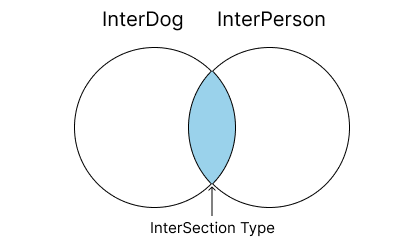

# 타입스크립트 원리와 개념을 더 이해해 보기

## 1. 타입 계층도

- 타입스크립트에서 타입간 계층이 있기 때문에 아래에 있는 타입이 상위에 있는 타입으로 취급은 가능(업캐스팅)하나 그 반대(다운 캐스팅)는 불가능
- 이전에 unknown 타입에 여러 타입이 올 수 있으나, 해당 타입에 unkown타입이 올 수 없는 것을 알 수 있다.


### unknown 타입과의 계층 관계

- unknown은 제일 상위 단계에 있는 타입, 모든 타입은 unkown 타입의 부분 집합
- 그래서 unknown은 모든 타입일 수 있고 unknown타입에 할당 할 수 있다.

```ts {numberLines}
let a: unknown = 1; // number -> unknown ✅
let b: unknown = "hello"; // string -> unknown ✅
let c: unknown = true; // boolean -> unknown ✅
let d: unknown = null; // null -> unknown ✅
let e: unknown = undefined; // undefined -> unknown ✅
let f: unknown = []; // Array -> unknown ✅
let g: unknown = {}; // Object -> unknown ✅
let h: unknown = () => {}; // Function -> unknown ✅
```

unknown타입을 다른 타입에 할당하면 에러가 발생한다.

```ts {numberLines}
let unknowntype: unknown;
let num: number = unknowntype; // ❌ 'unknown' 형식은 'number' 형식에 할당할 수 없습니다.
```

### never 타입과의 계층 관계

- never 타입은 전체 타입에서 가장 낮은 위치에 있다.
- 모든 타입은 never가 될 수 있지만, never는 never제외 모든타입이 불가능하다.

```ts {numberLines}
function errorFunc(): never {
  throw new Error();
}

let neverA: number = errorFunc(); // never -> number ✅
let neverB: string = errorFunc(); // never -> string ✅
let neverC: boolean = errorFunc(); // never -> boolean ✅
let neverD: null = errorFunc(); // never -> null ✅
let neverE: undefined = errorFunc(); // never -> undefined ✅
let neverF: [] = errorFunc(); // never -> Array ✅
let neverG: {} = errorFunc(); // never -> Object ✅
```

```ts {numberLines}
let a: never = 1; // number -> never ❌
let b: never = "hello"; // string -> never ❌
let c: never = true; // boolean -> never ❌
let d: never = null; // null -> never ❌
let e: never = undefined; // undefined -> never ❌
let f: never = []; // Array -> never ❌
let g: never = {}; // Object -> never ❌
```

### void 타입과의 계층 관계

- void 타입은 undefined, never타입을 포함한다. 그렇기에 이외에는 값을 할당 받을 수 없다.

```ts {numberLines}
let voidVar: void;

voidVar = undefined; // undefined -> void (ok) ✅

let neverVar: never;
voidVar = neverVar; // never -> void (ok) ✅
```

### any 타입과의 계층 관계

- any 타입은 계층 관계를 무시하는 타입 입니다.
- 해당 타입에 따라 상위 레벨이 될수도 있고 하위 레벨이 될 수도 있는 타입 입니다.
- 하지만 any타입이 never에 할당하면 에러가 발생한다. never는 아무것도 다운캐스트를 할 수 없기 때문이다.

```ts {numberLines}
let anyValue: any;
let unknownValue: unknown;

unknownValue = anyValue; // any -> unknown (업 캐스트) ✅
anyValue = unknownValue; // any <- unknown (다운 캐스트) ✅
```

```ts {numberLines}
function errorFunc(): never {
  throw new Error();
}
let anyVar: any;
anyVar = errorFunc(); // never -> any ✅
errorFunc() = anyVar; // any -> never ❌
```

## 2. 객체 타입의 호환

- 객체 프로퍼티가 적은 쪽이 슈퍼 타입

```ts {numberLines}
type Animal = {
  name: string;
  color: string;
};

type Dog = {
  name: string;
  color: string;
  breed: string;
};

let animal: Animal = {
  name: "기린",
  color: "yellow",
};

let dog: Dog = {
  name: "바둑이",
  color: "brown",
  breed: "시고르자브종",
};

animal = dog; // dog object -> animal object ✅
dog = animal; // animal object -> dog object ❌
```

```ts {numberLines}
type Book = {
  name: string;
  price: number;
};

type ProgrammingBook = {
  name: string;
  price: number;
  skill: string;
};

let book: Book;

let programmingBook: ProgrammingBook = {
  name: "JS",
  price: 10000,
  skill: "js",
};
book = programmingBook; // ProgrammingBook object -> Book object type ✅
programmingBook = book; //  Book object type ->  ProgrammingBook object ❌
```

- Book 타입의 프로퍼티가 ProgrammingBook타입의 프로퍼티와 일치하고 ProgrammingBook타입이 추가 프로퍼티가 있다.
- 그러면 Book타입은 슈퍼 타입이고 ProgrammingBook타입은 서브 타입이 된다.

### 초과 프로퍼티 검사

- 객체 타입 변수를 초기화 하는 값으로 객체 리터럴을 사용하면 발동하는 기능
- 타입에 정의된 프로퍼티 외의 다른 초과된 프로퍼티를 갖는 객체를 변수에 할당하면 에러를 발생 시킨다.
- 변수로 저장한 객체를 초기화 값으로 사용하면 에러가 발생하지 않는다.

```ts {numberLines}
type Book = {
  name: string;
  price: number;
};

let book2:Book ={
  name:"Typescript"
  price:20000
  skill:"TS" // ❌ 초과된 프로퍼티가 있기 때문에 에러가 발생한다.
}
```

```ts {numberLines}
type Book = {
  name: string;
  price: number;
};

type ProgrammingBook = {
  name: string;
  price: number;
  skill: string;
};

let programmingBook: ProgrammingBook = {
  name: "JS",
  price: 10000,
  skill: "js",
};

let book3: Book = programmingBook; // ✅  book3에 저장한 객체 변수인 programmingBook을 할당 하면 에러가 발생하지 않는다.
```

## 3. 대수 타입

여러개의 타입을 조합하여 새롭게 타입을 정의

### 합집합(Union) 타입

- Union 타입은 `|` 기호를 사용하여 정의한다.

- 일반 타입에서 Union

```ts {numberLines}
let a: number | string | boolean; // number, string, boolean union type
a = 1;
a = "Hello";
a = true;
```

- 배열에서 Union

```ts {numberLines}
let arr: (number | string | boolean)[] = [1, "hi", false];
```

- 객체에서 Union

```ts {numberLines}
type Dog = {
  name: string;
  color: string;
};

type Person = {
  name: string;
  language: string;
};

type Union1 = Dog | Person;

let union1: Union1 = {
  name: "",
  color: "",
};
// ✅
let union2: Union1 = {
  name: "",
  language: "",
};
// ✅
let union3: Union1 = {
  name: "",
  color: "",
  language: "",
};
// ✅
```

- union4는 name만 선언한 프로퍼티에 해당하는 객체 타입이 없어서 에러가 발생

```ts {numberLines}
type Dog = {
  name: string;
  color: string;
};

type Person = {
  name: string;
  language: string;
};

type Union1 = Dog | Person;
let union4: Union1 = {
  name: "", // ❌ error
};
```

- 아래와 같이 Person1 타입을 선언하면 union4도 실행 된다.

```ts {numberLines}
type Dog = {
  name: string;
  color: string;
};

type Person = {
  name: string;
  language: string;
};

type Person1 = {
  name: string;
};

type Union1 = Dog | Person | Person1;

let union4: Union1 = {
  name: "", // ✅
};
```

### 교집합(Intersection) 타입

- 여러 타입의 속성을 모두 가지는 타입을 정의한다.
- Intersection 타입은 `&` 기호를 사용하여 정의한다.

원시 타입을 교집합으로 선언할 경우 never타입으로 변경된다.

```ts {numberLines}
let variable: number & string;
```

- 객체 타입의 교집합

```ts {numberLines}
type InterDog = {
  name: string;
  color: string;
};

type InterPerson = {
  name: string;
  language: string;
};

type Intersection = InterDog & InterPerson;

let Intersection1: Intersection = {
  name: "",
  color: "",
  language: "",
};
// ✅

let Intersection2: Intersection = {
  name: "",
  color: "",
  // ❌ language 프로퍼티가 없어서 에러가 발생한다.
};
```



## 4. 타입 추론

### 기본 추론

- 초기화 한 값의 타입을 추론한다.
- 함수는 리턴된 값의 타입을 추론한다.

```ts {numberLines}
let a = 10; // let a: number
let b = "hello"; // let b: string
let c = { name: "HK", age: 20 }; // let c: { name: string; age: number;}

// 구조 분해 할당
let { name, age } = c; // let name :string,  let age: number
let [one, two, three] = [1, "hi", true]; // let one :number, let two: string, let three: boolean

// 함수는 리턴 타입에 대한 추론

function func() {
  return "hello";
}
// function func(): string

function func(message = "hi") {
  // message: string, 매개변수에 대한 타입 추론
  return "hello";
}
```

### 암묵적 any 타입 추론

- 어떤 변수에 초기값을 설정하지 않으면 암묵적으로 그 변수의 타입은 any으로 선언되고 할당한 값의 타입에 따라 변수의 타입도 진화 한다.
- 할당한 값에 따라 타입이 바뀌기 때문에 쓰지 않는 것이 좋다.

```ts {numberLines}
let d; // any type
d = 10; // number type
d.toFixed(); // number method
d = "hello"; // string type으로 변경
d.toUpperCase(); // string method
d.toFixed(); // ❌ type error
```

### const 상수 타입 추론

- const로 선언한 상수의 타입은 리터럴 타입으로 추론한다.

```ts {numberLines}
const num = 10; // const num: 10
const str = "hello"; // const str: "hello"
```

### 여러 타입 추론

```ts {numberLines}
let arr = [1, "hello"]; // let arr: (string | number)[]
```

const 상수로 선언한 타입은 리터털 타입만 가질 수 있지만, let으로 선언한 타입은 리터럴 타입이 아닌 해당 값의 기본 타입을 가질 수 있어 범용성있는 타입을 가질 수 있게 된다.

## 5. 타입 단언

- 타입을 타입스크립트 컴파일러에게 명시적으로 지정, 실제적으로 변수의 타입은 변경하지 않는다.
- value `as` Type 지정한다.

```ts {numberLines}
type Person = {
  name: string;
  age: number;
};
let person = {} as Person;
// 빈 객체는 Person 타입이 아니기 때문에 에러가 발생하지만,
// person 객체에 Person 타입을 단언하면 에러가 발생하지 않는다.
person.name = "hello";
person.age = 11;
```

타입단언은 초과 프로퍼티 검사를 피할 수 있다.

```ts {numberLines}
type Dog = {
  name: string;
  color: string;
};

let dog = {
  name: "백구",
  color: "white",
  breed: "jindo",
} as Dog;
```

breed의 추가 프로퍼티가 있지만 Dog타입으로 단언했기 때문에 초과 프로퍼티 검사를 피했다.

### 타입 단언 규칙

- A as B 일때 A가 B의 슈퍼 타입이거나, A가 B의 서브타입 일때만 에러가 발생하지 않는다.

```ts {numberLines}
let num1 = 10 as never; // number가 never의 슈퍼 타입
let num2 = 10 as unknown; // number가 unknown의 서브 타입
let num3 = 10 as string; // ❌ number타입과 string타입과 겹치는 부분이 없기 때문에 에러 발생
```

### 다중 단언

```ts {numberLines}
let num4 = 10 as unknown as string; // number -> (슈퍼 타입) unknown -> (서브 타입) string
// 좋은 방법은 아님
```

### const 단언

- 타입을 const로 단언하면 변수는 리터럴 타입으로 단언 되고, 객체면 프로퍼티는 readonly 타입으로 단언됨

```ts {numberLines}
let name4 = 10 as const;
name4 = 1; // ❌ 리터럴로 타입단언되어 값을 수정하면 에러가 발생한다.

let cat = {
  name: "cats",
  color: "yellow",
} as const;
cat.name = "dog"; // ❌ 프로퍼티들은 readonly가 되어 값을 수정할 수 없다.
// let cat: {readonly name: "cats"; readonly color: "yellow";}
```

### Non Null 단언

- null이나 undefined 타입이 아닐 경우를 단언
- `!`을 사용하여 선언한다.

```ts {numberLines}
type Post = {
  title: string;
  author?: string;
};

let post: Post = {
  title: "title1",
  author: "user1",
};
const len: number = post.author?.length; // ❌
// author를 선택적 프로퍼티(?)로 지정하면 author는 string | undefined 유니언 타입으로 지정된다.
// post.author 타입이 undefined도 포함 되어 있어서 length 메서드와 undefined 타입이 일치 하지 않기 때문에 에러가 발생한다.
// 에러를 수정하기 위해서 author의 undefined타입을 Non Null 단언하여 undefined 타입이 아니라고 단언 한다.
const len: number = post.author!.length; // ✅
```

## 6. 타입 좁히기

조건문 등을 이용해 넓은타입에서 좁은타입으로 변경한다.

- value => number : toFixed
- value => string : toUpperCase
- value => Date : getTime

```ts {numberLines}
function func(value: number | string | Date | null) {
  // value.toFixed(); // ❌
  // value.toUpperCase(); // ❌
  if (typeof value === "number") {
    // type guard
    return typeof value.toFixed(); // ✅
  } else if (typeof value === "string") {
    return value.toUpperCase(); // ✅
  } else if (typeof value === "object") {
    // 여기에 Date뿐만 아니라 null값도 통과하기 때문에 에러 발생
    return value.getTime(); // ❌
  }
}
```

수정 후

```ts {numberLines}
function func(value: number | string | Date | null) {
  // value.toFixed(); // ❌
  // value.toUpperCase(); // ❌
  if (typeof value === "number") {
    // type guard
    return typeof value.toFixed();
  } else if (typeof value === "string") {
    return value.toUpperCase();
  } else if (value instanceof Date) {
    // value가 Date 객체인지 판별
    return value.getTime(); // ✅
  }
}
console.log(func(24.2222)); //24
console.log(func("hello")); // HELLO
console.log(func(new Date())); // 1685619342210
```

- value => number : toFixed
- value => string : toUpperCase
- value => Date : getTime
- value => Person : name은 age살 입니다.

```ts {numberLines}
type Person = {
  name: string;
  age: number;
};
function func(value: number | string | Date | null | Person) {
  // value.toFixed(); // ❌
  // value.toUpperCase(); // ❌
  if (typeof value === "number") {
    // type guard
    return typeof value.toFixed();
  } else if (typeof value === "string") {
    return value.toUpperCase();
  } else if (value instanceof Date) {
    // value가 Date 객체인지 판별
    return value.getTime(); // ✅
  } else if (value instanceof Person) {
    // ❌ 클래스가 아닌 타입 별칭으로 만든 객체 타입이라 instanceof를 사용할 수 없다.
  }
}
```

수정 후

```ts {numberLines}
type Person = {
  name: string;
  age: number;
};
function func(value: number | string | Date | null | Person) {
  // value.toFixed(); // ❌
  // value.toUpperCase(); // ❌
  if (typeof value === "number") {
    // type guard
    return typeof value.toFixed();
  } else if (typeof value === "string") {
    return value.toUpperCase();
  } else if (value instanceof Date) {
    // value가 Date 객체인지 판별
    return value.getTime(); // ✅
  } else if (value && "age" in value) {
    // in 뒤에 타입은 undefined나 null이 올수 없음
    // value가 true 일때 "age" in value 실행
    return `${value.name}은 ${value.age}살 입니다.`;
  }
}
console.log(func(24.2222)); //24
console.log(func("hello")); // HELLO
console.log(func(new Date())); // 1685619342210
const value = { name: "user1", age: 24 };
console.log(func(value)); // user1은 24살 입니다.
```

## 7. 서로소 유니온 타입

- 교집합이 없는 타입으로만 이루어진 유니온 타입 예) number 타입과 string 타입관계

```ts {numberLines}
type Admin = {
  name: string;
  kickCount: number;
};
type Member = {
  name: string;
  point: number;
};
type Guest = {
  name: string;
  visitCount: number;
};

type User = Admin | Member | Guest;
// Admin -> {name}님 현재까지 {kickCount}명 강퇴했습니다.
// Member -> {name}님 현재까지 {point}모았습니다.
// Guest -> {name}님 현재까지 {visitCount}번 오셨습니다.

function login(user: User) {
  if ("kickCount" in user) {
    console.log(`${user.name}님 현재까지 ${user.kickCount}명을 강퇴했습니다.`);
  } else if ("point" in user) {
    console.log(`${user.name}님 현재까지 ${user.point}모았습니다.`);
  } else {
    console.log(`${user.name}님 현재까지 ${user.visitCount}번 오셨습니다.`);
  }
}
```

위의 코드는 복잡하고 직관적이지 않아서 아래와 같이 tag 프로퍼티에 리터털 타입의 string을 선언하면 교집합이 성립하지 않아서 서로소의 집합관계를 가진다.

```ts
type Admin = {
  tag: "ADMIN"; // string 리터럴타입
  name: string;
  kickCount: number;
};
type Member = {
  tag: "MEMBER"; // string 리터럴타입
  name: string;
  point: number;
};
type Guest = {
  tag: "GUEST"; // string 리터럴타입
  name: string;
  visitCount: number;
};
type User = Admin | Member | Guest;

function login(user: User) {
  if (user.tag === "ADMIN") {
    console.log(`${user.name}님 현재까지 ${user.kickCount}명을 강퇴했습니다.`);
  } else if (user.tag === "MEMBER") {
    console.log(`${user.name}님 현재까지 ${user.point}모았습니다.`);
  } else {
    console.log(`${user.name}님 현재까지 ${user.visitCount}번 오셨습니다.`);
  }
  // switch문
  switch (user.tag) {
    case "ADMIN":
      console.log(`${user.name}님 현재까지 ${user.kickCount}명을 강퇴했습니다.`);
      break;
    case "MEMBER":
      console.log(`${user.name}님 현재까지 ${user.point}모았습니다.`);
      break;
    case "GUEST":
      console.log(`${user.name}님 현재까지 ${user.visitCount}번 오셨습니다.`);
      break;
  }
}
```

### 비동기 처리 할때 서로소 유니온 타입 사용하기

서로소 유니온 타입 적용하지 않을때

```ts
type AsyncTask = {
  state: "LOADING" | "FAILED" | "SUCCESS";
  error?: { message: string };
  response?: { data: string }; //  LOADING상태일때 error와 response 데이터가 필요하지 않아서 선택적 프로퍼티를 선언한다.
};

// 로딩 중 -> 콘솔에 로딩중 출력
// 실패 -> 실패 : 에러메시지 출력
// 성공 -> 성공 : 데이터 출력
function processResult(task: AsyncTask) {
  switch (task.state) {
    case "LOADING":
      console.log(task.state);
      break;
    case "FAILED":
      console.log(task.error?.message);
      break;
    case "SUCCESS":
      console.log(task.response?.data);
      break;
  }
}

const loading: AsyncTask = { state: "LOADING" };
const failed: AsyncTask = { state: "FAILED", error: { message: "error 404" } };
const success: AsyncTask = { state: "SUCCESS", response: { data: "data" } };
```

서로소 유니온 타입으로 수정하기

변경하면 타입이 좁아지기 때문에 해당하는 타입 alias부분만 선택할 수 있어서 위의 코드와 같이 선택적 프로퍼티를 선언하지 않아도 된다.

```ts {numberLines}
type LoadingTask = {
  state: "LOADING";
};

type FailedTask = {
  state: "FAILED";
  error: { message: string };
};
type SuccessTask = {
  state: "SUCCESS";
  response: { data: string };
};
type AsyncTask = LoadingTask | FailedTask | SuccessTask; // 서로소 유니온 타입

// 로딩 중 -> 콘솔에 로딩중 출력
// 실패 -> 실패 : 에러메시지 출력
// 성공 -> 성공 : 데이터 출력
function processResult(task: AsyncTask) {
  switch (task.state) {
    case "LOADING":
      console.log(task.state);
      break;
    case "FAILED":
      console.log(task.error.message);
      break;
    case "SUCCESS":
      console.log(task.response.data);
      break;
  }
}
const loading: AsyncTask = { state: "LOADING" };
const failed: AsyncTask = { state: "FAILED", error: { message: "error 404" } };
const success: AsyncTask = { state: "SUCCESS", response: { data: "data" } };
```

## referance

- [한입 타입스크립트 핸드북](https://ts.winterlood.com/)
