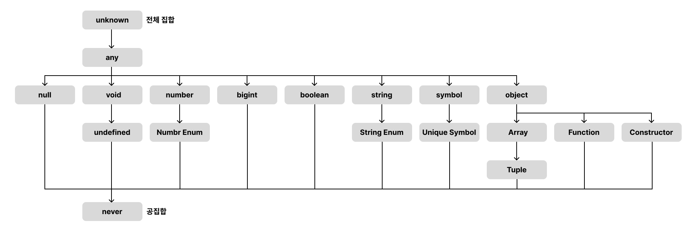

# 타입스크립트 원리와 개념을 더 이해해 보기

## 1. 타입 계층도

- 타입스크립트에서 타입간 계층이 있기 때문에 아래에 있는 타입이 상위에 있는 타입으로 취급은 가능(업캐스팅)하나 그 반대(다운 캐스팅)는 불가능
- 이전에 unknown 타입에 여러 타입이 올 수 있으나, 해당 타입에 unkown타입이 올 수 없는 것을 알 수 있다.



### unknown 타입과의 계층 관계

- unknown은 제일 상위 단계에 있는 타입, 모든 타입은 unkown 타입의 부분 집합
- 그래서 unknown은 모든 타입일 수 있고 unknown타입에 할당 할 수 있다.

```ts {numberLines}
let a: unknown = 1; // number -> unknown ✅
let b: unknown = "hello"; // string -> unknown ✅
let c: unknown = true; // boolean -> unknown ✅
let d: unknown = null; // null -> unknown ✅
let e: unknown = undefined; // undefined -> unknown ✅
let f: unknown = []; // Array -> unknown ✅
let g: unknown = {}; // Object -> unknown ✅
let h: unknown = () => {}; // Function -> unknown ✅
```

unknown타입을 다른 타입에 할당하면 에러가 발생한다.

```ts {numberLines}
let unknowntype: unknown;
let num: number = unknowntype; // ❌ 'unknown' 형식은 'number' 형식에 할당할 수 없습니다.
```

### never 타입과의 계층 관계

- never 타입은 전체 타입에서 가장 낮은 위치에 있다.
- 모든 타입은 never가 될 수 있지만, never는 never제외 모든타입이 불가능하다.

```ts {numberLines}
function errorFunc(): never {
  throw new Error();
}

let neverA: number = errorFunc(); // never -> number ✅
let neverB: string = errorFunc(); // never -> string ✅
let neverC: boolean = errorFunc(); // never -> boolean ✅
let neverD: null = errorFunc(); // never -> null ✅
let neverE: undefined = errorFunc(); // never -> undefined ✅
let neverF: [] = errorFunc(); // never -> Array ✅
let neverG: {} = errorFunc(); // never -> Object ✅
```

```ts {numberLines}
let a: never = 1; // number -> never ❌
let b: never = "hello"; // string -> never ❌
let c: never = true; // boolean -> never ❌
let d: never = null; // null -> never ❌
let e: never = undefined; // undefined -> never ❌
let f: never = []; // Array -> never ❌
let g: never = {}; // Object -> never ❌
```

### void 타입과의 계층 관계

- void 타입은 undefined, never타입을 포함한다. 그렇기에 이외에는 값을 할당 받을 수 없다.

```ts {numberLines}
let voidVar: void;

voidVar = undefined; // undefined -> void (ok) ✅

let neverVar: never;
voidVar = neverVar; // never -> void (ok) ✅
```

### any 타입과의 계층 관계

- any 타입은 계층 관계를 무시하는 타입 입니다.
- 해당 타입에 따라 상위 레벨이 될수도 있고 하위 레벨이 될 수도 있는 타입 입니다.
- 하지만 any타입이 never에 할당하면 에러가 발생한다. never는 아무것도 다운캐스트를 할 수 없기 때문이다.

```ts {numberLines}
let anyValue: any;
let unknownValue: unknown;

unknownValue = anyValue; // any -> unknown (업 캐스트) ✅
anyValue = unknownValue; // any <- unknown (다운 캐스트) ✅
```

```ts {numberLines}
function errorFunc(): never {
  throw new Error();
}
let anyVar: any;
anyVar = errorFunc(); // never -> any ✅
errorFunc() = anyVar; // any -> never ❌
```

## 2. 객체 타입의 호환

- 객체 프로퍼티가 적은 쪽이 슈퍼 타입

```ts {numberLines}
type Animal = {
  name: string;
  color: string;
};

type Dog = {
  name: string;
  color: string;
  breed: string;
};

let animal: Animal = {
  name: "기린",
  color: "yellow",
};

let dog: Dog = {
  name: "바둑이",
  color: "brown",
  breed: "시고르자브종",
};

animal = dog; // dog object -> animal object ✅
dog = animal; // animal object -> dog object ❌
```

```ts {numberLines}
type Book = {
  name: string;
  price: number;
};

type ProgrammingBook = {
  name: string;
  price: number;
  skill: string;
};

let book: Book;

let programmingBook: ProgrammingBook = {
  name: "JS",
  price: 10000,
  skill: "js",
};
book = programmingBook; // ProgrammingBook object -> Book object type ✅
programmingBook = book; //  Book object type ->  ProgrammingBook object ❌
```

- Book 타입의 프로퍼티가 ProgrammingBook타입의 프로퍼티와 일치하고 ProgrammingBook타입이 추가 프로퍼티가 있다.
- 그러면 Book타입은 슈퍼 타입이고 ProgrammingBook타입은 서브 타입이 된다.

### 초과 프로퍼티 검사
- 객체 타입 변수를 초기화 하는 값으로 객체 리터럴을 사용하면 발동하는 기능
- 타입에 정의된 프로퍼티 외의 다른 초과된 프로퍼티를 갖는 객체를 변수에 할당하면 에러를 발생 시킨다.
- 변수로 저장한 객체를 초기화 값으로 사용하면 에러가 발생하지 않는다.

```ts {numberLines}
type Book = {
  name: string;
  price: number;
};

let book2:Book ={
  name:"Typescript"
  price:20000
  skill:"TS" // ❌ 초과된 프로퍼티가 있기 때문에 에러가 발생한다.
}
```

```ts {numberLines}
type Book = {
  name: string;
  price: number;
};

type ProgrammingBook = {
  name: string;
  price: number;
  skill: string;
};

let programmingBook: ProgrammingBook = {
  name: "JS",
  price: 10000,
  skill: "js",
};

let book3: Book = programmingBook; // ✅  book3에 저장한 객체 변수인 programmingBook을 할당 하면 에러가 발생하지 않는다.
```

## 3. 대수 타입

## 4. 타입 추론

## 5. 타입 단언

## 6. 타입 좁히기

## referance

- [한입 타입스크립트 핸드북](https://ts.winterlood.com/)
