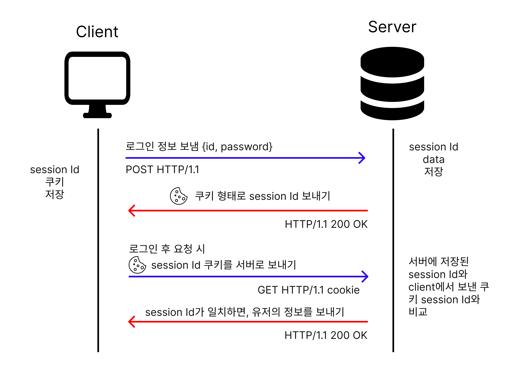
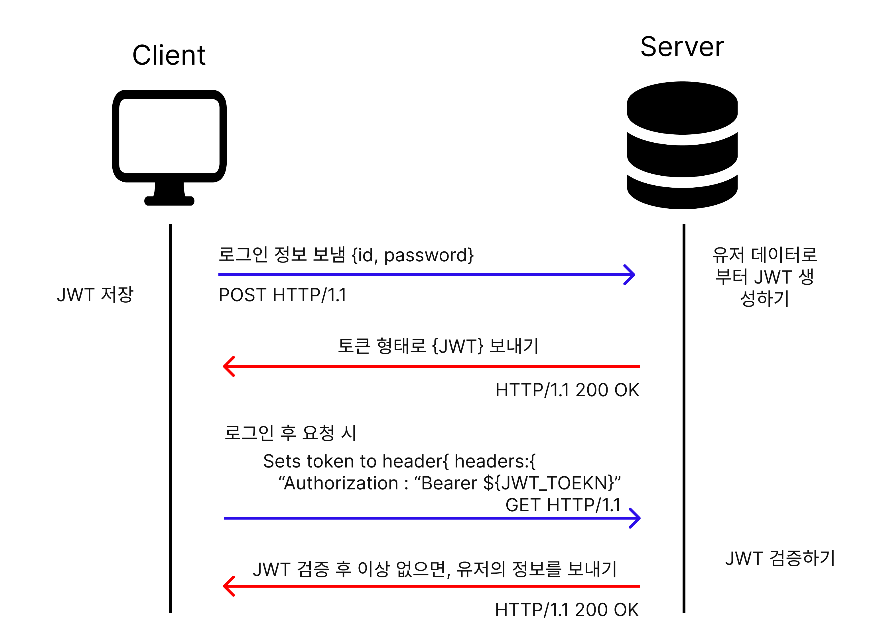
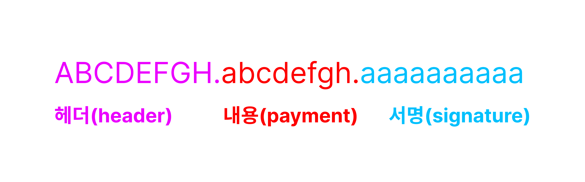

웹에서 로그인 시 어떻게 인증과정이 이루어지는지 궁금하고, 개념을 명확하게 하고 싶었다.

## 정의

웹에서 사용자 인증 방법은 웹 사이트나 애플리케이션에서 사용자의 신원을 확인하고 인증, 사용자 인증은 보안과 관련이 있으며, 비인가자가 해당 서비스에 접근하는 것을 방지하기 위해 필요하다

## 종류

### 1. 세션 방식

- 세션 방식은 서버 측에서 사용자 정보를 저장하고, 클라이언트 측에서는 세션 ID를 쿠키 또는 URL 파라미터로 담아서 보냄
- 클라이언트가 요청을 보낼 때마다 세션 ID를 서버에 전달하여 인증하고, 성공 시 세션 ID와 연관된 유저 정보를 검색하여 요청하여 처리

#### 세션 동작 방식



1. 사용자가 로그인 페이지에 접속하여 아이디와 비밀번호를 입력
2. 웹 서버는 입력받은 아이디와 비밀번호를 검증하여, 사용자가 인증되었다면 세션 ID를 발급
3. 세션 ID는 서버 측에서 유지되며, 클라이언트(브라우저)에는 쿠키(Cookie) 형태로 저장
4. 사용자가 다른 페이지에 접속할 때, 브라우저는 서버로 세션 ID를 전송
5. 서버는 전송받은 세션 ID를 검증하고 타당하면 클라이언트에게 응답을 보낸다.

#### 장점

- 상태 정보를 서버에 저장하기 떄문에 보안성이 높아진다.
- 클라이언트의 session id들을 서버에 저장했기 때문에, 클라이언트들을 컨트롤할 수 있다.
- 서버와 클라이언트들 간에 서로 다른 세션 아이디를 사용하기 때문에, 여러 클라이언트들을 동시에 처리할 수 있습니다.

#### 단점

- 서버에 세션 데이터를 저장하기 떄문에, 접속자가 많을 경우 서버의 과부화가 걸림
- 과부화를 해결하기 위해 서버를 확장해야 하므로 비용적인 측면에서 경제적 부담이 발생할 수 밖에 없다.
- 세션 ID를 쿠키에 저장하기 때문에, 쿠키가 조작될 가능성이 많음.

### 2. 토큰 방식

- 토큰 방식은 인증된 사용자에게 발급된 토큰을 사용하여 인증 처리
- 토큰은 JWT(JSON Web Token)형식으로 발급,
- 클라이언트는 HTTP request 헤더나 URL 파라미터에 토큰을 포함하여 서버에 전달
- 서버는 해당 토큰을 검증하고, 인증이 성공하면 해당 토큰에 포함된 정보를 사용하여 처리

#### 토큰 동작 방식



1. 사용자가 로그인 페이지에 접속하여 아이디와 비밀번호를 입력
2. 웹 서버는 입력받은 아이디와 비밀번호를 보고, 유효하면 토큰을 만든다.
3. 서버는 생성한 토크을 클라이언트에게 보내고, 토큰을 저장한다.
4. 클라이언트가 서버에 요청 시 JWT 토큰 헤더를 서버에 전달
5. 서버는 클라이언트가 보낸 JWT가 타당하면, 클라이언트에게 응답을 보낸다.

#### 장점

- 토큰을 클라이언트에 저장되기 때문에 staeless하고, 서버의 부담이 적고 서버를 확장하기 쉽다.

#### 단점

- 보안성이 취약, 만일 토큰을 탈취되면 인증이 가능하므로, 토큰을 안전하게 괸리해야 한다.

#### JWT 구조



- Header
  토큰의 타입과 해싱 알고리즘 지정

  ```json
  {
    "alg": "HS256",
    "typ": "JWT"
  }
  ```

  - lg : 해싱 알고리즘, HMAC SHA256, RSA
  - yp : 토큰의 타입,

- payload

  토큰에 담길 data

  ```json
  {
    "sub": "1234567890",
    "name": "John Doe",
    "iat": 1516239022
  }
  ```

  - sub : 토큰 제목, 주로 사용자 id
  - name : 사용작 이름
  - lat : 토큰 발급 시간

- signature

  - 토큰의 위변조 여부를 확인 하는데 사용

  - base64로 인코딩된 header와 payload를 합치고, secret의 키를 이용하여 생성된 서명값

  ```js
  HMACSHA256(base64UrlEncode(header) + "." + base64UrlEncode(payload), secret);
  ```

  - HMACSHA256 : 서명 알고리즘
  - base64UrlEncode : URL-safe한 Base64로 인코딩
  - header, payload : 각각 header, payload의 값
  - secret : 서명에 사용되는 비밀 키

## reference

- [[Server] 토큰 기반 인증 VS 서버(세션) 기반 인증](https://mangkyu.tistory.com/55)

- [What really is the difference between session and token based authentication](https://dev.to/thecodearcher/what-really-is-the-difference-between-session-and-token-based-authentication-2o39)

- [세션 동작 방식](https://velog.io/@hyun6ik/%EC%84%B8%EC%85%98-%EB%8F%99%EC%9E%91-%EB%B0%A9%EC%8B%9D)

- [JWT토큰이란, 장단점, 구현](https://gorokke.tistory.com/181)

- [jwt](https://jwt.io/)
