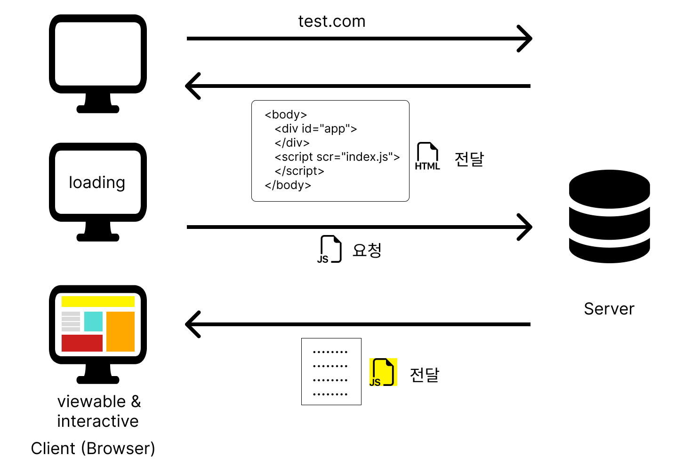
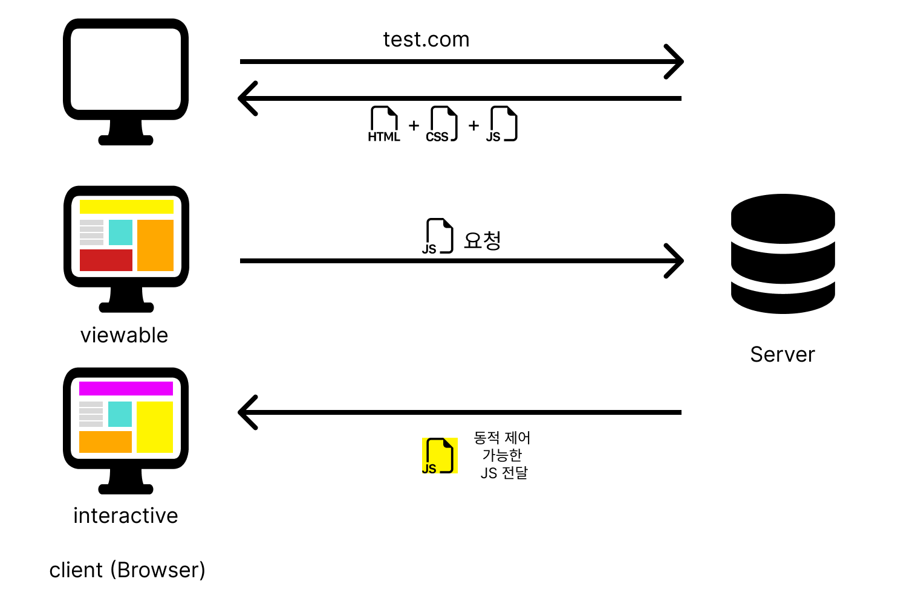

## CSR (Client Side Rendering)

CSR은 클라이언트 측에서 Javascript를 사용하여 **동적으로 페이지를 렌더링** 하는 방식.

즉, 클라이언트에서 데이터 요청 시 서버에서는 필요한 데이터만 전달하고, 클라이언트에서 데이터와 javascript를 이용하여 페이지를 렌더링 한다.

대표적으로 SPA(react, Angular ,Vue)가 여기에 속한다.

### 1. 동작 방식

1. 브라우저에서 웹사이트 접속하여 웹 페이지 요청하기
2. 클라이언트에서 요청한 웹 페이지 전달하기(앱에서 필요한 js 링크가 포함된 단순한 html페이지 전달)
3. 서버에 앱에서 필요한 javascript파일을 요청 후 다운로드 받음 (모든 소스 코드가 포함되어 있기 때문에 크기가 크고 다운 받는 데 시간이 걸릴 수 있음)

### 2. 장점

- 초기 로딩이 끝나고 이후 작업에서는 서버에 의존하지 않고 클라이언트 자체내에서 빠른 페이지 화면 전환
- 페이지의 일부분만 동적으로 업데이트 할 수 있기 때문에, 전체 페이지를 다시 로드하지 않고도 빠른 인터랙션 가능

### 3. 단점

- 사용자가 첫 화면을 보게 될 경우 javascript파일을 다운받아야 하므로, 느린 로딩이 발생하고 시간도 오래 걸릴 수 있다.
- 초기 페이지 로딩시 html은 아무 내용이 없기때문에, 검색 엔진이 크롤링 할 수 있는 내용이 적어져 SEO문제가 발생한다.

## SSR(Server Side Rendering)

서버에서 HTML과 필요한 데이터를 렌더링하고, 클라이언트에 전달하여 브라우저에서 페이지를 보여 주는 방식

### 1. 동작 방식

1. 브라우저에서 웹사이트 접속하여 웹 페이지 요청하기
2. 서버에서 렌더링에 필요한 파일(HTML + CSS + JS)파일을 만들어 브라우저에게 보냄
3. 브라우저에서는 로딩 없이 페이지가 표시되지만, 이벤트 같은 동적으로 조작은 불가능
4. 서버에서 동적 제어 가능한 javascript를 다운받으면 이벤트 동작할 수 있는 인터랙션이 가능

### 2. 장점

- 서버에서 필요한 데이터를 모두 가져와서 브라우저에게 보내기 때문에 초기 페이지 로딩속도가 빠르다.
- html에 모든 컨텐츠가 담겨져 있어서 SEO를 효율적으로 적용할 수 있다.

### 3. 단점

- 웹사이트에 사용자가 많아지면 서버에서 HTML을 생성하여 클라이언트에 전달해야 하는 빈도가 많아지므로 서버의 과부하가 걸리기 쉽다.
- 초기 로딩 후 이벤트 동작을 하려면 동적으로 처리하는 javascript를 서버에서 다시 다운 받아야 하는데, 받지 않아서 반응이 없는 경우가 발생할 수 있다.

## reference

- [CSR/SSR, SPA/MPA, PWA](https://tech.weperson.com/wedev/frontend/csr-ssr-spa-mpa-pwa/#csr-client-side-rendering-vs-ssr-server-side-rendering)

- [서버사이드 렌더링 (개발자라면 상식으로 알고 있어야 하는 개념 정리 ⭐️)](https://www.youtube.com/watch?v=iZ9csAfU5Os&t=196s)
